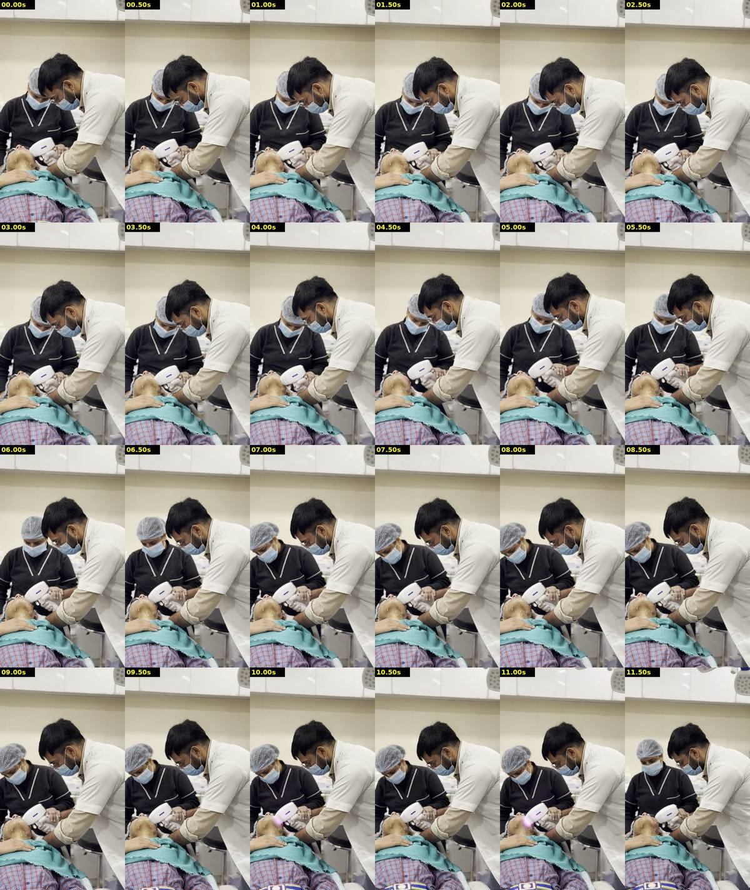
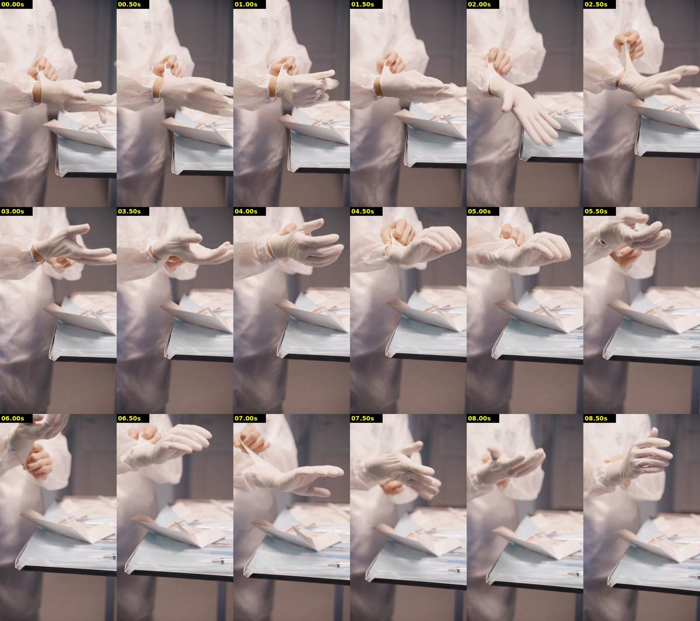
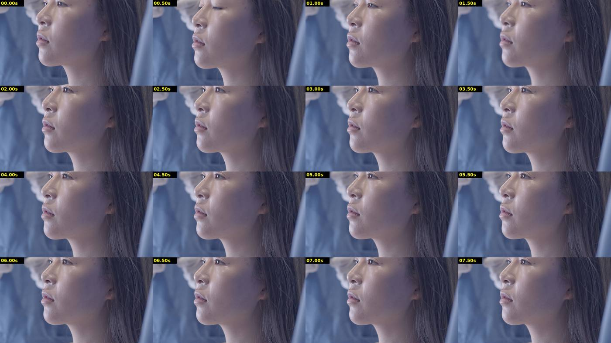
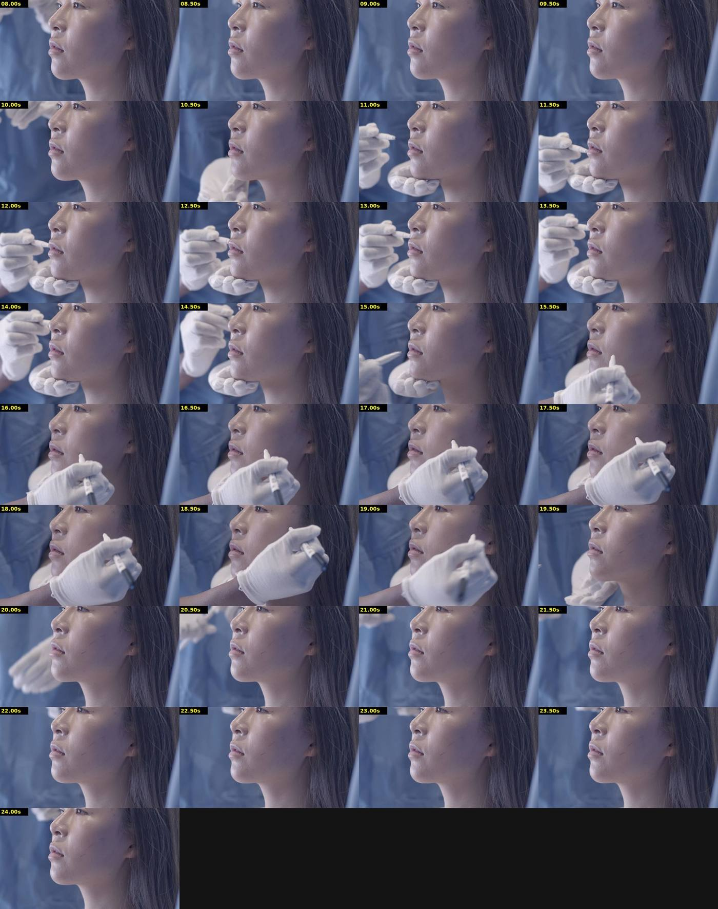
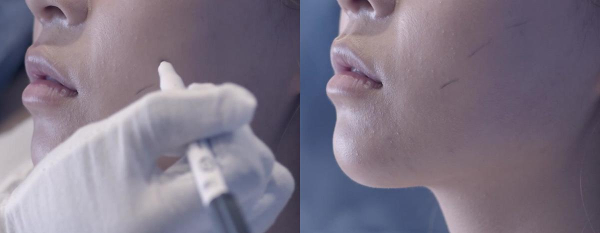
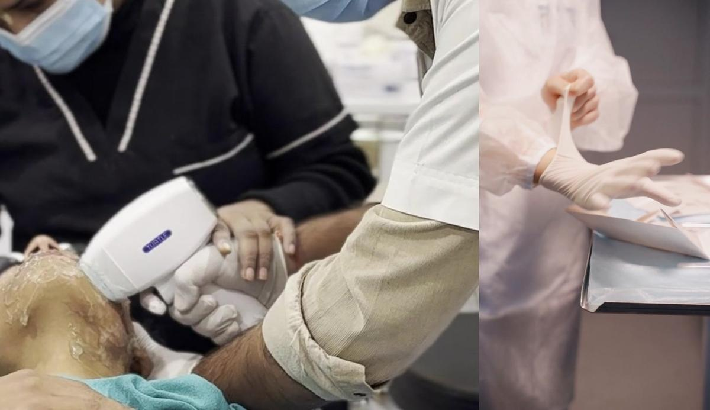

# 슈리링의원(殊璃鈴 / SHURIRING) 15초 옥외 광고 — 레퍼런스 분석과 설계안

강남대로 전광판(1일 50회, 9:16 세로, 무음) 송출용 15초 브랜드 필름을 위해, 첨부하신 레퍼런스 클립 3편을 프레임 단위로 분석하고 그 영상 문법만 추출해 슈리링의원 버전으로 재구성한 제작 문서입니다.

**이 문서를 읽기 전에**

- 레퍼런스 3편은 완성 광고가 아니라 **오디오·자막이 없는 원테이크 스톡 클립**입니다. 그래서 음악·효과음·자막 항목은 "관찰"이 아니라 "이 동작 리듬 위에 무엇을 얹어야 하는가"로 답했습니다. 사운드 없이 진행해도 된다고 하셨으므로, 15초 설계는 **무음에서 성립하는 시각 사건**을 기준으로 짰고 효과음은 "있으면 좋은" 수준으로만 붙였습니다.
- 분석은 0.25~0.5초 간격 프레임 전수 확인과 프레임 단위 계측(밝기·채도·옵티컬 플로우·선명도·컷 감지)을 근거로 했고, 클립마다 광학·내용 두 관점의 반박 검증을 거쳐 원본 분석의 오독을 정정했습니다. 본문에서 "검증"이라고 표시한 수치는 그 결과입니다.
- 15초 설계는 워치메이커 / 동양 아틀리에 / 하이엔드 테크 세 방향의 독립 초안을 심사해 통합한 단일안이며, 브리프의 강조 9항목·금지 9항목·15.0초 합계·무음 옥외 가독성을 검수했습니다.
- 원장님 프로필(30대 초반, 짧은 다크 웨이브 헤어, 네이비 스크럽 위 흰 가운)을 인물 묘사와 의상·조명 판단에 반영했습니다. 흰 가운을 벗고 네이비 스크럽만 입는 제안은 조명 근거가 있는 판단이지만 클라이언트 확인 항목으로 남겼습니다.
- 슈링크 유니버스 실물의 세부(카트리지 결합 방식, 핸드피스 발광 표시 유무)는 촬영 시 확인이 필요하며, 설계는 발광에 의존하지 않도록 했습니다.

**문서 구성**

- Part 1 — 레퍼런스 영상 분석: 계측 결과, 클립별 타임라인과 15개 항목, 세 클립을 관통하는 문법, 가장 좋은 장면 5
- Part 2 — 슈리링 버전 15초 설계: 컨셉과 리듬, 스토리보드 표, 엔딩 카드, A. 아이폰 촬영 목록, B. AI 생성 프롬프트, 편집·그레이딩 가이드, 리스크와 대안

---

# Part 1. 레퍼런스 영상 분석

### 0. 분석 방법과 계측 결과

세 클립을 프레임 단위로 뜯어 보았습니다. 0.5초 간격 정지 프레임(총 93장)과 0.25초 간격 프레임을 전부 확인했고, 필요한 순간은 원본 해상도로 다시 추출했습니다. 눈으로 본 것과 별개로, 매 프레임의 밝기·채도·색상·옵티컬 플로우(카메라/피사체 움직임)·라플라시안 선명도(초점 위치)·프레임 간 차이(컷 감지)를 계산해 판단의 근거로 삼았습니다.

**먼저 알아두실 점 세 가지**

- 세 클립 모두 **오디오 트랙이 없는 스톡 클립**입니다(파일명 패턴이 Pexels 다운로드 형식). 완성된 광고가 아니라 소재 클립이므로 음악·효과음·자막은 존재하지 않습니다. 12·13·14번 항목은 "관찰"이 아니라 "이 동작 리듬에 무엇을 얹어야 하는가"로 답했습니다.
- 세 클립 모두 **하드 컷이 없는 원테이크**입니다. 프레임 간 픽셀 차이가 컷 임계치(8/255)를 넘는 순간이 한 번도 없습니다. 따라서 "컷 지속시간"은 편집이 아니라 **행동 단위**(손이 들어옴 → 접촉 → 이탈)로 나눠 계측했습니다. 이 점이 오히려 유용한데, 우리가 배울 것은 편집 리듬이 아니라 **한 컷을 어떻게 세우는가**이기 때문입니다.
- 슬로모션 여부는 프레임 중복 패턴으로 검사했습니다. V3에서 손이 움직이는 구간의 프레임 간 차이가 주기적으로 0에 떨어지지 않고 부드럽게 변하므로 **프레임 복제 방식의 슬로모션은 아닙니다**. 고프레임 촬영 후 컨폼했거나, 실제로 느리게 움직인 것 중 하나이며 둘 중 어느 쪽인지는 파일만으로 단정할 수 없습니다.

| 클립 | 내용 한 줄 | 해상도 · 프레임 | 길이 | 컷 | 중간 밝기 (0–255) | 최저 5% 밝기 | 채도 평균 | 지배 색상 | 평균 움직임량 |
|---|---|---|---|---|---|---|---|---|---|
| V1 | 밝은 시술실, 의사가 핸드피스로 얼굴 시술 (미디엄) | 1080×1920 세로 · 30fps | 13.0초 | 0 (원테이크) | 200 (매우 밝음) | 24–31 | 52 | 크림/살구 (hue 17) | 0.17 (거의 고정, 핸드헬드 미세 흔들림) |
| V2 | 흰 장갑을 끼는 손 (클로즈업) | 1080×1920 세로 · 25fps | 9.0초 | 0 (원테이크) | 135 (중간) | 68–78 | 33 (저채도 파스텔) | 핑크/살구 (hue 7–8) | 0.88 (손 동작 + 약한 핸드헬드) |
| V3 | 푸른 톤 환자 옆얼굴, 장갑 손이 펜으로 라인 (클로즈업) | 3840×2160 가로 · 25fps | 24.3초 | 0 (원테이크) | 94 (어두운 중간) | 39–43 | 67–72 | 블루 (hue 115) | 0.05–0.15 정지 구간 / 0.75–1.9 손 동작 구간 |

계측에서 바로 읽히는 사실 몇 가지입니다.

- **V3는 "어둡지만 검정이 없는" 화면입니다.** 가장 어두운 5% 픽셀조차 41/255 수준이고 25 미만 픽셀 비율은 0%입니다. 그림자를 살짝 들어 올린(lifted black) 시네마틱 그레이딩이며, 이것이 "어둡고 고요한데 답답하지 않은" 인상의 정체입니다. 슈리링 광고의 배경도 순수 검정(#000)이 아니라 이 정도로 살짝 들린 어둠에 하이라이트만 또렷하게 세우는 편이 낮 시간 전광판에서 유리합니다.
- **V1은 정반대의 밝기 분포**입니다. 중간 밝기가 200을 넘고 95% 픽셀이 253(거의 클리핑)입니다. 배경 벽과 가운이 전부 하얗게 날아가서 피사체(핸드피스, 손)가 배경과 분리되지 않습니다. "일반 피부과 광고 느낌"의 물리적 원인이 여기에 있습니다.
- **V2는 채도를 크게 뺀 파스텔**입니다. 채도 33은 V3(70)의 절반 이하입니다. 살구빛 조명 아래 흰 장갑이 "따뜻하지만 밋밋한" 톤을 만들고, 배경(회청색 벽)이 흐려져 심도만으로 고급감을 만들고 있습니다.
- **카메라는 세 클립 모두 사실상 고정**입니다. 움직임량이 큰 구간은 전부 피사체(손)의 움직임이고, 줌인/줌아웃 신호는 손이 렌즈 쪽으로 다가오거나 멀어질 때만 나타납니다. 즉 레퍼런스가 주는 교훈은 "카메라를 움직이지 말고 피사체가 프레임 안에서 움직이게 하라"입니다.
- **V3의 가장 빠른 움직임은 손이 빠져나가는 19–20초**(움직임량 1.92)이고, 들어올 때(10.5초, 0.75 / 15.5초, 0.95)보다 두 배 빠릅니다. "천천히 들어와서, 일을 마치면 미련 없이 빠진다"는 손의 문법이 수치로 확인됩니다.

### 1. V1 — 밝은 시술실의 투샷: 58 BPM 보라 펄스, 그리고 "이렇게 찍으면 동네 병원이 된다"


*V1 0.5초 간격 콘택트 시트. 시트 라벨은 원본보다 약 0.2초 늦게 찍혀 있다(10.00s·11.00s 타일의 보라 글로우는 실제로는 10.20·11.23초 펄스). 본문의 시각은 전부 원본 프레임을 직접 스캔한 값이다.*

크림색 시술실에서 흰 가운의 의사(우측 2/3)와 검은 스크럽의 보조자(중앙 좌측)가, 젤을 바르고 보호 고글을 쓴 채 누운 환자(좌하)의 턱선에 흰 핸드피스를 대고 있는 13초 원테이크입니다. 카메라는 핸드헬드로 아주 느리게 위로 흘러가고, 보이는 사건은 두 종류뿐입니다. 핸드피스 팁에서 2프레임(67ms)씩 터지는 보라색 펄스 7회(0.80 / 2.90 / 7.10 / 8.13 / 9.17 / 10.20 / 11.23초)와, 11.57초 팁 이탈 뒤 의사가 몸을 세우며 보조자에게 기구를 넘기려는 마지막 1초입니다. 슈리링 관점에서 이 클립이 중요한 이유는 두 가지입니다. 첫째, 펄스가 정확히 31프레임(1.033초) 간격으로 58 BPM 격자에 정박해 "기계의 정밀함을 리듬으로 증명하는" 문법을 그대로 보여줍니다. 둘째, 조명·배경·색·구도는 우리가 피해야 할 것의 정확한 표본입니다. 이 클립이 평범해 보이는 물리적 원인이 프레임에 전부 찍혀 있어서, 그 반대로만 가면 됩니다.

| 구간(초) | 무슨 일이 일어나는가 | 피사체·위치 | 샷 크기 | 카메라 움직임 | 앵글·렌즈 | 조명 | 색 | 초점 | 슬로모 |
|---|---|---|---|---|---|---|---|---|---|
| 0.0–3.0 | 접촉 유지 홀드 · 펄스 0.80, 2.90(각 2프레임) · 의사는 실내 기준 정지, 프레임상 하강은 카메라 틸트 | 의사 우 2/3 · 보조자 중앙좌(맨손이 처음부터 기구 위) · 환자 머리 좌하 30% · 핸드피스 x25–44% | MS~MLS(의사 머리~허벅지 74%) · 환자 머리는 CU 크기 | 핸드헬드 틸트업 드리프트 +55px · 가로 ±10px · 롤 0.4° 시작 | 약한 하이앵글 · 의사 좌측 3/4 · 근접 광각~표준(추정) | 천장 확산 탑라이트 · 무그림자 · 얼굴이 옷보다 어두움 | 크림/웜화이트 hue 17 · 6색 혼재 · 무보정(추정) | 의사 얼굴~기구~환자 얼굴 · 보조자 소프트 · 랙포커스 없음 | 없음(30p 실속도) |
| 3.0–4.0 | 클립 최정지 구간 · 카메라·인물 모두 멈춤(flow 0.06) · 펄스 없음 | 동일 · 의사·보조자 두 시선이 접촉점으로 수렴 | 동일 | 정지(±3px) · 5.5초까지 카메라 정지 | 동일 | 동일 · 명암 변화 최저 | 동일 | 고정 | 없음 |
| 4.0–5.5 | 의사가 머리를 약 75–80px(높이 4%) 듦 — 실제 피사체 동작 | 의사 머리 중앙 상단으로 이동 · 나머지 동일 | 동일 | 정지 유지 | 동일 | 동일 | 동일 | 고정 | 없음 |
| 5.5–7.1 | 보조자 좌측으로 약 250px(폭 20–23%) 이동 · 손/얼굴 겹침 풀림 · 펄스 없음(재배치) | 보조자 좌 1/3 · 맨손은 계속 핸드피스 윗면 | 두 얼굴 분리 → 투샷으로 읽힘 | 드리프트 재개 +13~18px(롤 포함) | 동일 | 보조자 얼굴이 캡 그늘에서 벗어남 | 동일 | 고정 | 없음 |
| 7.1–9.2 | 펄스 트레인 A: 7.10(최대·헤일로 넓음) / 8.13 / 9.17 · 간격 정확히 31프레임 | 펄스 위치 x≈28%, y≈70%(팁 아래 젤) | 동일 | 7.7–9.5 틸트다운 보정 −26px | 동일 | 펄스 순간 +2.6(7.10) · 롤링셔터 행 대역 물듦 | 펄스 핑크마젠타, 7.10만 바이올렛 | 고정 | 없음(펄스 2프레임) |
| 9.2–11.3 | 펄스 트레인 B: 10.20 / 11.23(가장 작고 응집) · 11.23이 마지막 | 보조자 x 120→270으로 복귀 | 동일 | 9.5–10.0 방향 반전 +22px(가장 급함) · 이후 틸트업 +60~80px · 미세 후퇴 신호 | 동일 | 펄스 순간 +0.3~0.4 | 동일 | 고정 | 없음 |
| 11.3–12.2 | 11.57 팁 이탈 시작(팁 창 분홍 노출) · 11.70 창 정면 · 12.0 완전 이탈 · 고글 완전 노출 11.8 | 핸드피스 중앙 하부→중앙 · 좌측 가장자리 펌프 보틀 진입 | 동일 | 틸트업 지속(캐비닛선 y≈14%) · 두 번째 수술등 상단 진입 | 동일 | 동일 | 동일 | 고정 | 없음 |
| 12.2–13.0 | 의사 기립·우측 이동(끝까지 진행, 휴지 없음) · 12.6 보조자 손 접촉 · 12.7–13.0 두 사람이 함께 파지 | 의사 머리 y 14%, x 74%까지 · 핸드피스 정중앙 · 배경 서랍·스프레이 캔 노출 | MLS에 가까움(머리~허벅지 86%) | 거의 정지(+7px) · flow 급등은 피사체 | 기립으로 약한 로우앵글 느낌 | 가운 대면적 클리핑(≥250 픽셀 24%) | 채도 최저(흰 면적 증가) | 고정 · 12.77 pdiff 최대는 컷 아님 | 없음 |

표에 다 담기지 않는 것을 몇 가지 풀어 씁니다.

**"의사가 더 숙인다"는 착시였습니다.** 0.9~3.0초 사이 프레임에서 의사 머리가 약 50px 내려오는데, 같은 구간 배경(캐비닛 하단선)도 55px 내려옵니다. 머리와 배경의 상대 위치는 ±6px로 불변입니다. 즉 이건 피사체 동작이 아니라 카메라 틸트업입니다. 반대로 4.0~5.0초의 머리 상승(약 80px)은 배경이 4px밖에 안 움직여서 진짜 동작입니다. 이 구분이 중요한 이유는, 이 클립에서 "사람과 카메라가 함께 멈춘 앵커 구간"이 3.0~4.0초 1초뿐이고, 워프 스태빌라이즈를 걸면 0~4.0초 전체 4초가 락오프 홀드로 살아난다는 뜻이기 때문입니다.

**카메라는 "순수 틸트업"이 아니라 핸드헬드 드리프트입니다.** 0→12.5초 누적 세로 변위는 좌측 기준 약 +125px, 우측 기준 약 +150px(높이의 6.5~7.8%)로 좌우가 다른데, 이 차이가 시계방향 약 1.5° 롤입니다. 12초대에 캐비닛 수평선이 기울어 보이는 이유입니다. 가로도 ±20px 스윙이 있고, 9.5~11.5초에는 배경 스케일이 2~6% 줄고 우상단 수술등 헤드(근경)가 캐비닛(원경)보다 크게 왼쪽으로 밀리는 시차가 있어 미세한 후퇴/줌아웃이 동반된 것으로 보입니다(약한 근거). 목적이 있는 무브가 아니라 자세 흔들림입니다.

**렌즈와 심도.** 의사 머리 폭이 보조자 머리 폭의 약 2배인데 두 사람의 실제 거리 차는 1m 안팎입니다. 이 비율은 카메라가 의사에게서 1~1.5m 거리에 있을 때 나오는 근접 원근이라, 원근이 눌린 망원이 아니라 스마트폰 1x 메인 카메라급 광각~표준(24~35mm 환산, 추정)으로 판단했습니다. 화면이 평평해 보이는 원인은 렌즈가 아니라 조명입니다. 한편 초점면 1m 뒤의 보조자는 서랍장과 비슷한 정도로 흐리고(선명도 70 vs 의사 570 vs 서랍 52) 광학적으로 폰 광각에서 나오기 어려운 흐림이라, 소프트웨어 인물/시네마틱 모드이거나 대구경 카메라일 가능성을 병기합니다(추정). 흥미로운 점은, 결과적으로 이 클립이 "투샷"이 아니라 **전경 1인 초점 + 소프트한 2인**이라는 것입니다. 이 구조 자체는 슈리링의 "1인 시술자 + 실루엣 배경" 문법에 쓸 수 있습니다.

**조명은 천장 확산 탑라이트 하나입니다.** 가운 어깨 윗면 251 vs 옆면 204, 핸드피스 윗면 클리핑, 캐비닛 바로 아래 벽이 더 어둡고(229) 내려갈수록 밝아지는(240) 캐비닛 그림자 — 모두 수직 위 광원의 증거입니다. 환자 턱 밑에는 그림자가 없고(이마 209 vs 목 212), 뚜렷한 접촉 그림자는 의사 팔 아래 타월(2:1) 하나뿐입니다. 정작 문제는 고개를 숙인 두 시술자의 **얼굴이 프레임에서 가장 어두운 피부(의사 118~132, 보조자 91)이고 흰 가운은 250으로 클리핑**된다는 점입니다. 얼굴/옷의 명암이 뒤집힌 이 관계가 "동네 병원 톤"의 실제 원인이며, 배경색보다 큰 문제입니다. 0초에 화면 픽셀의 16.9%, 12.5초에 24.3%가 정보 없는 흰색(≥250)입니다.

**펄스는 절반이 센서 아티팩트입니다.** 7.10초 펄스 프레임을 행 단위로 보면 팁이 있는 행(y 1320~1440)은 색차가 +4에 그치는데, 팁에서 멀리 떨어진 보조자 스크럽 행(y 960~1200)이 +22~28로 가장 강하게 보라로 물듭니다. 젤 반사로는 설명되지 않고, 초단시간 섬광을 롤링셔터가 특정 행 대역에 기록한 결과입니다. "2프레임 지속"도 노출창이 두 프레임에 걸친 것입니다. 접촉점의 젤 헤일로 자체는 실재하지만 작습니다(10.20초 기준 약 3천 픽셀). 크기 순위도 정정합니다. **면적·밝기 모두 7.10초가 압도적 1위**(다른 펄스의 5~6배 면적, 프레임 밝기 +2.6)이고, 10.20/11.23은 가장 작고 응집된 점광입니다. 넓은 헤일로 레퍼런스는 7.10, 점광 레퍼런스는 10.20/11.23으로 용도를 나눠야 합니다. 색은 기본이 핑크-마젠타(약 320°)이고 7.10초만 바이올렛(약 294°) 쪽입니다.

**보조자의 맨손은 처음부터 끝까지 핸드피스 위에 있습니다.** 6.5초에 "손이 얹힌다"가 아니라, 보조자가 왼쪽으로 옮겨가면서 손과 얼굴의 겹침이 풀려 보이기 시작하는 것입니다. 의사는 흰 라텍스 장갑, 보조자는 맨손이라는 위생 연출의 불일치도 기록해 둡니다.

#### 편집 활용(전환·인아웃·평균 지속)

하드컷은 없고 행동 단위는 8개입니다. 접촉 홀드 0.0–3.0(3.0초) / 완전 정지 3.0–4.0(1.0초) / 머리 들기 4.0–5.5(1.5초) / 재배치 5.5–7.1(1.6초) / 펄스 트레인 A 7.1–9.2(2.1초) / 펄스 트레인 B 9.2–11.3(2.1초) / 이탈 11.3–12.2(0.9초) / 기립·접촉 12.2–13.0(0.8초). **평균 약 1.6초**이고, 사건(펄스·이탈·접촉)은 0.07~0.5초 단위입니다.

- **인 포인트 후보**: 3.0초(카메라·인물 모두 정지, 가장 안전) / 0.0초(스태빌라이즈 전제, 0.80·2.90 펄스 포함) / 7.0초(첫 트레인 펄스 3프레임 전) / 10.1초 이후(가장 응집된 10.20 펄스 직전 — 9.9초는 9.5~10.0초의 급한 카메라 반전 직후라 불안정).
- **아웃 포인트 후보**: 11.30초(마지막 펄스 직후, 이탈 전 — 가장 깔끔) / 11.57~11.63초(팁 창의 분홍이 드러나는 순간을 컷 모션으로) / 12.6~12.9초(보조자 손이 닿은 직후). 기립은 클립 끝까지 계속되고 인계도 완료되지 않으므로 12초대에는 휴지 프레임이 없습니다. "세션 종료" 비트로 쓰려면 동작 중간에서 컷하거나 페이드로 끊어야 합니다.
- **권장 사용 길이**: 1.5~3초(펄스 2~3회가 들어가는 7.0→9.3 또는 10.1→11.4). 5.5~7.1 재배치 구간은 목적 없는 움직임이라 버립니다.
- **같은 클립 내 점프컷 주의**: 캐비닛 하단의 어두운 모서리 선이 틸트업을 따라 186→315px로 내려가므로, 떨어진 구간을 붙이면 이 선이 튑니다. 3초 이내 근접 구간끼리만 붙이고, 자막·컷 모두 이 선을 기준선으로 관리합니다.

#### 리듬과 효과음(무음 클립이므로 제안)

펄스 트레인 213→244→275→306→337프레임은 모두 정확히 31프레임(1.0333초)이라 **58.06 BPM**입니다. 앞의 두 펄스도 같은 격자 위에 있습니다. 0.80→2.90은 63프레임(2박+1프레임), 2.90→7.10은 126프레임(4박+2프레임)이라, 58 BPM 트랙 하나 위에서 "쉼표가 있는 박"으로 전부 쓸 수 있습니다. 하프타임 필이 필요하면 116 BPM의 2박마다 펄스가 떨어집니다.

- **비트 포인트(초)**: 0.80, 2.90, 7.10, 8.13, 9.17, 10.20, 11.23(펄스) · 11.57(팁 이탈 시작) · 12.25(기립 시작 — 정점은 클립 안에 없음) · 12.60(보조자 손 접촉).
- **효과음 제안(프레임 근거)**: 각 펄스(2프레임, 67ms)에 릴리즈가 짧은 전자음 '틱' + 저역 '툭'. 피부에 밀착된 상태의 발광이므로 타격음보다 전자 펄스음이 맞습니다. 7.10초만 나머지보다 한 단계 크게(면적 5~6배). 11.57~11.80초 젤에서 팁이 떨어지는 습식 '쩍'. 12.2~12.9초 흰 가운 옷자락 마찰(대면적 이동). 12.60초 보조자 손이 핸드피스 후단에 닿는 플라스틱 '탁'. 0~12초 룸톤은 공조 험 수준으로 낮게 깔아 정지감을 유지합니다.

#### 자막 공간

상단은 균일한 흰 밴드가 아니라 **3단 구조**입니다. 흰 캐비닛 면(y 0~약 10~13%, 틸트업에 따라 점점 넓어짐) → 폭 40px의 어두운 모서리 선(밝기 160) → 크림색 벽(y 13~30%). 자막은 캐비닛 면 안(y<9%)이나 모서리 선 아래 크림 벽(y 13~30%, x<20~50%)에 두고, 모서리 선을 가로지르지 않게 배치해야 합니다. 두 영역 모두 밝기 230~250이라 **어두운 자막**만 가능합니다. 피해야 할 것: 0~11초 우상단 수술등 헤드(x>88%, y<10%), 12초 이후 상단 중앙에 들어오는 두 번째 헤드(x 55~72%, y<13%), 12.5초부터 y 14%까지 올라오는 의사 머리(x 62~100%), 11.5초 이후 좌측 가장자리(x<5%)의 흰 펌프 보틀. 결론적으로 **좌상단 x 5~50%는 클립 끝까지 비어 있는 유일한 영역**입니다. 크림 벽 x 0~20%는 4.5초 이전엔 보조자 머리가 침범하므로 7초 이후에만 쓸 수 있고, 하단 1/3(청록 타월·체크셔츠·환자 손·12.5초 이후 셔츠 라벨 패치)은 자막 불가입니다. 등장 방식은 이 클립의 리듬을 따라 **펄스 프레임에 맞춰 컷인(페이드 없음)**, 다음 펄스에 컷아웃이 자연스럽습니다.

#### 고급스러움의 이유 / 반대로 저급해 보이는 이유

고급감을 만드는 요소는 셋뿐이고 전부 "리듬과 정지"에 있습니다. (1) 펄스가 31프레임 간격으로 메트로놈처럼 반복되어 기계의 정밀함을 시간으로 증명합니다. (2) 3.0~4.0초의 완전 정지 — 카메라·손·기구가 모두 멈추고 의사와 보조자 두 시선이 핸드피스 축과 함께 접촉점에서 만납니다(환자는 고글로 시선이 없으므로 '삼각형'이 아니라 '2시선+1기구 축'). (3) 10.20/11.23초처럼 작고 응집된 펄스는 검은 스크럽 앞에서 흰 기구+분홍 점광이 실루엣처럼 분리됩니다 — 이 클립 스스로 "어두운 면 위에서만 빛이 산다"를 증명합니다(단 7.10초에는 스크럽까지 보라로 물들어 이 대비가 깨집니다).

저급해 보이는 이유는 훨씬 많고 전부 물리적입니다. 얼굴이 옷보다 어두운 탑라이트(얼굴 91~132 vs 가운 250), 화면 1/4이 정보 없는 흰색, 크림 벽의 노란 캐스트(hue 17), 통제되지 않은 6색(스카이블루 마스크·캡 2세트, 청록 올 풀린 타월, 적청 체크셔츠, 카키, 흰 가운, 흰 파이핑이 들어간 검은 스크럽), 서랍장·스틸 스툴·박스·스프레이 캔·수술등 헤드·펌프 보틀까지 다 보이는 미디엄 프레이밍, 동기 없는 핸드헬드 드리프트(틸트+롤+가로 흔들림+중간 역보정), 펄스 없는 재배치 1.6초, 두꺼운 젤 광택과 브랜드 라벨('TURTLE', 10초 전후 판독), 보호 고글, 장갑/맨손 불일치, 그리고 어디에서도 끝나지 않는 기립 동작입니다.

| 슈리링에 가져올 것 | 버릴 것 |
|---|---|
| 발광 2프레임(67ms)을 늘리지 않고 58 BPM 정박 이벤트로 쓰는 "펄스=비트" | 크림/웜화이트 벽·흰 캐비닛 같은 밝은 대면적 배경 |
| 기구 뒤에 무늬 없는 어두운 면을 두어 흰 기구+점광을 실루엣 분리(10.20/11.23초 방식) | 천장 확산 탑라이트와 클리핑된 흰 면 — 얼굴이 옷보다 어두워지는 관계 |
| 카메라·손·기구가 함께 멈춘 1~4초 홀드를 앵커 샷으로(3.0~4.0초, 안정화 시 0~4초) | 노란 캐스트의 자동 화이트밸런스, 6색 혼재 팔레트 |
| 시술자의 눈→손→팁이 한 선이 되는 카메라 위치(약한 하이앵글 3/4) | 방 전체가 보이는 미디엄 투샷과 배경 소품(서랍·스툴·캔·수술등) |
| 전경 1인 초점 + 뒤의 인물은 소프트로 처리하는 심도 구조 | 동기 없는 핸드헬드 드리프트(틸트·롤·역보정) |
| 팁 이탈(11.57초) 순간의 '분홍 창 노출'을 컷 모션 포인트로 | 목적 없는 재배치 구간, 클립 안에서 끝나지 않는 기립·인계 |
| 좌상단을 끝까지 비워 두는 프레이밍(어두운 배경에서는 밝은 자막으로 반전) | 두꺼운 젤, 보호 고글, 브랜드 라벨, 장갑/맨손 불일치 |
| — | 롤링셔터에 찍힌 펄스 대역 아티팩트(재현 금지: 글로벌셔터·펄스 동기 또는 후반 합성) |

### 2. V2 — 장갑을 조이는 손: 1프레임 스냅과 부유하는 카메라


*V2 0.5초 간격 콘택트 시트. 2.50s 타일의 팽팽한 커프와 3.00s 타일의 펼친 손 사이(2.92→2.96초)에 이 클립의 유일한 물리적 사건인 스냅이 있다.*

머리를 자른 가슴~허벅지 토르소 프레임 안에서, 맨손 왼손이 이미 낀 오른손 라텍스 장갑의 커프를 당겼다 놓기를 반복하는 9초 원테이크입니다. 사건은 2.92→2.96초, 단 1프레임 안에 커프가 손목으로 튕겨 돌아가는 스냅 하나이고, 그 직후 손이 뒤집히며(회외) 손바닥이 카메라를 향하는 것이 두 번째 시각 사건입니다. 초점은 전경 트레이의 크롬 모서리에 고정되어 있고 손은 4초까지는 선명하다가 5.5초 이후 초점면 앞으로 나가 소프트해집니다. 카메라는 고정이 아니라 9초 동안 프레임 폭의 42%에 해당하는 완만한 곡선(틸트다운 → 우측 병진 → 좌측 복귀+틸트업)을 그리는 짐벌/슬라이더급 무브입니다. 슈리링에 필요한 것은 이 클립의 색이나 배경이 아니라 **"느린 긴장(2~3초) → 1프레임 사건 → 이완(1초)"이라는 3박 구조**와, 손을 프레임 폭의 절반 이상으로 채우는 헤드리스 프레이밍, 그리고 라텍스 주름 위에 맺히는 새틴 하이라이트 줄무늬라는 재질 표현입니다.

| 구간(초) | 무슨 일이 일어나는가 | 피사체·위치 | 샷 크기 | 카메라 움직임 | 앵글·렌즈 | 조명 | 색 | 초점 | 슬로모 |
|---|---|---|---|---|---|---|---|---|---|
| 0.0–1.0 | 커프는 이미 집혀 짧게 늘어남 · 장갑 손가락이 안에서 자리잡느라 계속 움직임 · 빈 장갑 손가락 끝이 손끝 아래 늘어짐(0.7초까지) | 장갑 손 x 300–900/1080(폭 56%) · 맨손 엄지·검지 좌중앙 · 트레이 y 57–86% · 가운 좌측 | 헤드리스 MS(가슴~허벅지) · 실질 손 CU | 틸트/붐 다운 시작(토르소 상승 동작 혼재) | 하이앵글 약 20–35°(추정) · 토르소 45° 사선 · 렌즈 수치 불명 | 카메라 좌상 20–30°의 대형 소프트 프론트 라이트 · 라텍스 윗/아랫면 1.4:1 | 웜 핑크그레이 hue 7, sat 32 · 가운·장갑 살구빛 흰색 | 트레이 앞모서리·손목에 초점 · 배경 패널 완전 소프트 | 없음(25p, 중복 0%) |
| 1.0–2.5 | 커프 띠가 최대까지 길어짐 · 2.0–2.5 손목 방사형 주름 위 새틴 줄무늬 · 2.5 손가락 모션블러 | 커프 삼각형 좌상→우하 대각선 · 트레이 크롬 모서리와 평행 | 동일 | 틸트다운 지속(모서리 60px↑) · 2.2초 정지 | 동일 | 팽팽한 면 위 하이라이트 줄무늬(재질 최고 구간) | 동일 · p50 138 | 커프가 초점면 — 선명도 최대 | 없음 |
| 2.5–2.96 | 최대 긴장 → 2.92 마지막 유지 → 2.96 커프 이탈(1프레임 스냅) | 동일 | 동일 | 2.5초부터 우측 병진 시작 | 동일 | 동일 | 동일 | 커프 선명 | 없음(스냅 1프레임) |
| 2.96–4.2 | 손 상승·회외(손등→손바닥이 카메라 향함) · 손가락 활짝 · 3.04 픽셀차 피크 · 4.0–4.25 맨손이 커프 재파지 | 3.0 손 y 115–370/960 · 4.0 y 65–280, 손끝 x≈1060(우측 끝 근접) · 배경은 패널 도어 | 손이 상단 1/3 점유 | 우측 병진 지속(모서리 x 245→195) | 동일 | 손바닥이 가장 밝은 면(p95 227) · 손가락 아랫면 그늘 | 3–4초 p50 127(밝은 소매 자리에 어두운 벽 노출) | 4.0초 손은 0초와 동급으로 선명 | 없음 |
| 4.2–6.36 | 5.0–5.5 장갑 손 수평·손가락 느슨히 굽음 · 5.9–6.32 맨손 주먹이 커프를 당겨 흰 원뿔 · 6.36 콘 소멸(2차 이탈) | 두 손+콘이 상단 1/3 · 6.0 손가락 상단 잘림 · 트레이 좌측 끝까지 | 동일 · 두 손 덩어리 폭 70% | 우측 병진(모서리 x 195→82) · 배경은 절반만 이동 = 시차 | 60° 사선로 조금 더 정면(추정) | 원뿔 면에 넓은 새틴 광 · 맨손 주먹은 위 손의 그늘(152) | 파란 캐뉼라 캡 sat 18(가장 채도 높은 쿨톤) · 채도 최고는 맨살 | 손 소프트 시작(5.5↑) · 트레이 6.0–6.5 최고 선명 | 없음 |
| 6.36–7.3 | 손 우측 스윙(블러 피크 6.48) · 회내로 손등이 카메라 향함 · 6.5 맨손 이미 좌상단에서 커프 잡음 | 장갑 손 우측 프레임 끝 근접 · 맨손 좌상단 | 동일 | 병진 7.2까지 지속(x 82→35) + 붐업(y 700→758) | 동일 | 손등 전면이 넓게 밝음(림 아님) | 동일 | 손 소프트 · 트레이 선명 | 없음 |
| 7.3–8.0 | 7.3–7.5 맨손이 손목 위/뒤 · 7.52 말림 → 7.68 회전 → 7.76–7.86 검지 포인팅 → 7.92 펼침 · 7.84 pdiff 최대(컷 아님) | 장갑 손 중앙 · 맨손 7.6부터 손목 아래 주먹 | 동일 | 7.2 방향 반전, 좌측 복귀+틸트업(모서리 우하향) | 동일 | 회전 시 손바닥 순간 최고 밝기 | p50 143(가운 면적 증가가 주원인) | 손 소프트(라플라시안 3.7) | 없음(회전 0.2초) |
| 8.0–9.0 | 손가락 접었다 펴기 · 8.5 맨손 위 → 8.96 아래로 재조정 · 동작 중 종료(정지 프레임 없음) | 손 배경이 회색 벽이 아니라 흰 가운 → 실루엣 최악 | 동일 | 느린 우측 드리프트(폭 7%) | 동일 | 동일 | p50 148(최고), sat 30.7(최저) | 손 소프트 · 트레이 선명 | 없음 |

**카메라 궤적을 통째로 정정합니다.** 트레이 앞모서리를 추적하면 (260,805)@0초 → (245,737)@2.2초 → (195,700)@4.1초 → (82,700)@6.0초 → (35,758)@7.2초 → (102,807)@8.9초(540×960 기준)입니다. 가로 총 이동 225px(폭 42%), 세로 105px. 4~6초 사이 배경 벽은 트레이의 절반(≈55px)만 움직여 시차비 0.44 — 팬이 아니라 **카메라 병진**입니다. 궤적이 단조·저주파이고 프레임 간 지터가 없어 짐벌 또는 슬라이더로 보입니다. 다만 0~2.4초의 상승은 깊이별로 양이 다릅니다(가운 92 > 트레이 60 > 배경 레일 ≈50px). 카메라 틸트에 토르소가 위로 움직이는 피사체 동작이 겹쳐 있으니 순수 카메라 무브로 기술하면 안 됩니다. 결론은 "거의 고정"이 아니라 **"3단 아크를 그리는 매끄러운 부유"**입니다.

**초점의 실체.** 지표의 sharp center가 186→34로 떨어진 것은 손이 흐려진 게 아니라 손이 중앙 셀을 떠났기 때문입니다. 손 자체의 선명도는 4.0초까지 0초와 같고(≈10.6) 5.5초 이후 뚜렷이 소프트(3.7~7.6)해집니다. 트레이 앞모서리의 선명도도 일정하지 않아 카메라가 움직이는 2~3초·7~8초에는 절반 이하로 떨어지고 5.5~6.7초에 최고입니다. 소품 인서트로 프리즈할 프레임은 5.5초가 아니라 **6.0~6.5초**입니다. 의도적 랙포커스는 없습니다.

**조명·색의 실측.** 광원은 카메라 좌측·위쪽의 대형 소프트 광원인데, 3.0~4.0초에 카메라를 정면으로 향한 손바닥이 가장 밝은 면(p95 227)이 되는 것을 보면 측면 45°가 아니라 카메라 축에서 20~30° 정도 벗어난 프론트-소프트 라이트입니다(추정). 같은 라텍스의 윗면/아랫면 표시값 비는 1.4:1(선형 약 2:1)로 매우 평면적이고, 가운(223) 대 최암부인 맨손 손목 안쪽 피부(71)가 약 3:1(선형 약 11:1)입니다. 가운 하이라이트는 236에서 멈추고 클리핑(≥250)은 0%로, "날아간" 것이 아니라 하이키로 압축된 밝은 톤입니다. 프레임에서 진짜 검정은 트레이 전면의 검은 띠(밝기 24~36, 면적 0.5% 미만) 한 줄뿐이며 이 띠가 하단 1/3을 가로지르는 가장 강한 수평선입니다. 나머지는 p5≈70의 들린 블랙인데, 그레이딩인지 렌즈 헤이즈인지는 구분되지 않습니다. 배경은 단순 벽이 아니라 세로·가로 몰딩이 있는 **패널 도어/캐비닛**이고 색은 중성~약간 모브 그레이(89,82,87)입니다. 우측 끝 어두운 띠(78,80,87)만 미세하게 푸릅니다. 드레이프는 채도 5~7의 사실상 무채색이라 "페일 블루 액센트"라 부르기 어렵고, 프레임에서 가장 채도 높은 것은 맨살(57~121)입니다. 쿨 요소는 파란 캐뉼라 캡(sat 18), 소매 끝 파란 리브 커프, 우측 벽 띠 셋입니다. 가운 가슴에는 인쇄 라벨/로고가 흐릿하게 찍혀 있습니다.

**0초의 흰 조각.** 손끝 아래 늘어진 두 갈래 흰 형상은 원본에서 아직 손가락이 끝까지 들어가지 않은 빈 장갑 손가락 끝으로 보이며(추정, 파우치 필름일 가능성도 완전히 배제하지는 못함) 0.7~1.0초 사이 손가락을 밀어 넣으면서 사라집니다. 즉 0~1초의 실제 내용은 "준비 자세"가 아니라 장갑 손가락 자리잡기입니다.

#### 편집 활용(전환·인아웃·평균 지속)

행동 단위 6개: 커프 당김 0.0–2.96(2.96초) / 스냅+회외+펼침 2.96–4.2(1.24초) / 재파지+콘 4.2–6.36(2.16초) / 2차 이탈+스윙 6.36–7.3(0.94초) / 회전·플릭 7.3–8.0(0.7초) / 접기·펴기 8.0–9.0(1.0초). **평균 약 1.5초**, 사건은 1프레임(스냅)~0.2초(회전)입니다.

- **베스트 세그먼트 1.8→3.4초(1.6초)**: 커프가 늘어나는 중에 들어와(상황이 즉시 읽힘) 2.96 스냅을 지나 손바닥이 펼쳐질 때 나갑니다. 아웃을 3.4초로 잡는 이유는 그 뒤 손끝이 우측 프레임 끝(4.0초 x≈1060)에 닿아 사이드룸이 없어지기 때문입니다.
- **빌드업이 필요하면 0.0→3.4초(3.4초)**: 0초부터 커프가 이미 잡혀 있어 인이 깨끗합니다.
- **보조 컷 5.7→6.6초(0.9초)**: 콘→이탈→스윙. 형태는 좋으나 손이 소프트라 인서트용.
- **소품 프리즈 6.0~6.5초**: 트레이 크롬 립·주사기가 가장 선명한 프레임.
- **피할 구간 7.0~9.0초**: 목적 없는 재조정·플릭, 손 소프트, 배경이 흰 가운이라 실루엣 실패, 동작 중 종료.
- **권장 사용 길이**: 비트 컷 1.2~2.0초(스냅을 다운비트에), 페이오프 컷 최대 3.4초. 9초 전체 사용 비권장.

#### 리듬과 효과음(무음 클립이므로 제안)

내부 액센트는 2.96(스냅), 4.0(최대 펼침), 6.36(2차 이탈), 7.84(회전 플릭)이고 간격은 1.04 / 2.36 / 1.48초, 단순 평균 1.63초입니다. 4.0→6.36을 2박으로 세면 평균 1.22초 ≈ **50 BPM**(또는 100 하프타임)이 되고, 2.96을 '1'에 두면 그리드 4.16 / 5.36 / 6.56 / 7.76이 실제 액센트와 0.16 / — / 0.20 / 0.08초 차이로 맞습니다. 1.8→3.4초 세그먼트만 쓸 경우에는 어떤 BPM이든 **스냅(2.96)을 다운비트에 정렬하고 인 포인트를 그보다 1~1.2초 앞에서** 잡으면 됩니다.

- **효과음 순간**: 0.0~2.92 라텍스가 늘어나는 저역 크리프(피치 상승, 2.5초 최대 긴장 — 방사형 주름이 근거) → 2.94~2.96 라텍스 스냅 '탁'(1프레임, 가장 명확한 싱크 포인트) → 2.96~3.1 회외 시 짧은 마찰 → 3.0~4.0 손가락 벌릴 때 미세 삐걱 → 5.9~6.32 두 번째 크리프(원뿔) → 6.36 두 번째 스냅(첫 번째보다 작게) → 6.4~6.6 비닐 소매 러슬 → 7.66~7.86 손목 회전 짧은 러슬 → 8.0~8.6 손가락 접힘 마찰. 트레이 접촉음은 넣지 않는 편이 안전합니다. 접촉이 명확히 보이는 프레임은 없지만 0~0.5초 늘어진 장갑 끝이 파우치를 스칠 가능성은 배제되지 않습니다. 앰비언스는 공조 저역 험.

#### 자막 공간

- **우상단(1080×1920 기준 x 760~1080, y 40~660)**: 밝기 85~105의 어두운 중회색이라 흰 자막 대비가 좋습니다. 완전 단색은 아니고 세로 몰딩 라인이 소프트하게 비칩니다. 완전히 비는 구간은 **0.0~2.8초, 5.6~6.5초, 8.1~9.0초**뿐입니다. 스냅 직후 2.85초부터 손가락이 침범하므로(밝은 픽셀 18%) 스냅 페이오프 컷과 우상단 자막은 같이 쓸 수 없습니다. 6.7~7.5초와 7.9초에도 수평으로 뻗은 손끝이 영역 좌하부를 6~11% 침범하니 그 구간엔 x>950, y<300의 작은 모서리로 한정합니다.
- **하단 밴드(y>1660)**: 밝기 95~110, hue 7의 균일한 웜 그레이. 한 줄 소형 밝은 자막(로고·해시태그)에 적합. 두 줄이면 트레이 검은 띠와 충돌.
- **좌하단 가운(x 0~400, y 1400~1920)**: 흰 평면이 아니라 트레이 그늘의 중회색(80~130)입니다. 밝은 자막이 가능하지만 비닐 주름 때문에 차선. 유일하게 거의 흰 평면은 상단 좌측 소매(223)입니다.
- **금지**: 중앙 띠(y 660~1660) — 손·커프·트레이가 계속 움직이고, 8초대에는 손 배경이 흰 가운이라 어떤 자막도 못 읽힙니다.
- **등장 방식**: 이 클립에 어울리는 것은 사건이 없는 홀드(0~2.8초)에 페이드인했다가 **스냅(2.96) 프레임에 컷아웃**하는 방식입니다. 글자가 사라지는 것 자체가 스냅의 릴리즈가 됩니다.

#### 고급스러움의 이유 / 반대로 저급해 보이는 이유

고급감의 근원은 넷입니다. (1) 얕은 심도로 배경 패널과 가운 상단이 완전히 녹아 손·커프·트레이 모서리만 남는 정리된 화면(3×3 선명도 상단 45~131 vs 하단 302~306). (2) 소프트 라이트가 팽팽한 라텍스 주름 위에 새틴 줄무늬를 만드는 2.0~2.5초 — 재질이 '보이는' 순간. (3) 머리를 잘라 인물이 아니라 행위를 주인공으로 만든 익명성. (4) 느린 신장 → 1프레임 스냅 → 회외·펼침이라는 긴장/해소의 완결된 3박, 그것도 슬로모션 없이 실시간으로. 카메라의 부유도 정적인 준비 의식에 호흡을 주는 쪽으로 작동합니다.

저급하게 만드는 것은 다음입니다. 일회용 비닐 가운의 구겨진 광택(하이라이트는 클리핑되지 않았지만 '공장 위생복'으로 읽힘)과 가슴의 인쇄 로고, 뜯어진 종이 멸균 파우치가 겹쳐 쌓인 어수선한 트레이, 세로 몰딩이 손 뒤에서 가짜 리딩라인으로 작동하는 실제 진료실 패널 도어, 흰색을 살구빛으로 만드는 웜 캐스트(hue 7), 진짜 검정이 없는 들린 블랙(p5≈70)과 1.4:1의 평면적 조명, 5.5초 이후 초점면을 벗어난 손을 따라가지 않는 방치된 포커스, 6.0초 상단 잘림과 4.0초 우측 사이드룸 부족, 그리고 6.4~9.0초의 반복 재조정·플릭 끝에 동작 중간에서 끊기는 마무리입니다.

| 슈리링에 가져올 것 | 버릴 것 |
|---|---|
| 헤드리스 프레이밍에서 손을 프레임 폭의 55~65%로 채우는 손 클로즈업 | 웜 핑크 캐스트와 들린 블랙(p5≈70)의 하이키 파스텔 |
| 느린 긴장(2~3초) → 1프레임 사건 → 이완(1초)의 3박, 실시간 촬영 | 비닐 가운의 광택·로고, 어수선한 파우치 트레이 |
| 사건 직후의 회외(손등→손바닥)처럼 '밝은 면이 바뀌는' 동작을 조명 사건으로 설계 | 몰딩이 비치는 실제 진료실 배경 — 순흑 무광 배경으로 |
| 하단 1/3의 금속 수평선(크롬 립+검정 띠)과 커프 대각선의 이중 리딩라인 | 초점면을 벗어난 주인공 손을 방치하는 포커스 |
| 완만한 3단 아크의 부유 카메라(속도는 절반으로) | 상단 잘림·사이드룸 부족, 동작 중간 종료 |
| 저채도 팔레트 + 쿨 액센트 하나(이 클립에서는 약함 — 슈리링에선 기기 LED로 명확히) | 1.4:1의 프론트 소프트 조명 — 사이드/백 키로 6:1 이상 |
| 스냅 프레임에 자막을 컷아웃하는 '릴리즈형' 텍스트 타이밍 | 목적 없는 반복 재조정(6.4~9.0초) |

### 3. V3 — 푸른 옆얼굴 위의 세 획: 정지 → 개입 → 흔적


*V3 0~7.5초. 0~1.8초의 리프레이밍·포커스 헌팅과 눈 깜빡임(0.64~0.92초) 뒤, 좌상단에 대기하는 흰 장갑 두 개가 흐릿하게 머무는 긴 홀드.*


*V3 8~24초. 8.5초 클린 홀드 → 10.1~10.6 손 진입 → 11~14.8 팁을 대되 긋지 않는 패스 → 15.3 볼 도착 → 16.2/17.1/17.9 세 획 → 19.3 스윕 → 22초 결과 홀드.*

고정 카메라의 90° 옆얼굴 타이트 클로즈업입니다. 채도 높은 청색 드레이프 앞에 누운(추정) 여성의 좌향 프로필이 화면 우측 2/3을 차지하고, 얼굴이 향한 좌측 1/3은 비어 있습니다. 흰 면장갑 손이 좌상단(초점면 앞, 완전히 흐린 상태)에서 나타나 좌측 가장자리를 타고 내려와 턱을 받치고(10.6초), 따로 들어온 펜 손이 입술→인중→코→미간을 닿을 듯 훑고(11~14.8초), 0.2초 프레임 밖으로 나갔다 그립을 바꿔 돌아와 볼에 짧은 사선 3획(16.2 / 17.1 / 17.9초)을 긋고, 스윕으로 빠져나가면(19.3초) 볼 위에 약 1cm짜리 획 세 개만 남습니다. 슈리링에 이 클립이 가장 중요한 이유는, 우리가 만들려는 광고의 뼈대인 **"아무것도 일어나지 않는 홀드 → 손의 조용한 개입 → 같은 크기의 동작 3회 반복 → 빠른 이탈 → 흔적만 남는 정지"**가 한 테이크 안에 통째로 들어 있기 때문입니다. 단 색·조명·장갑·펜 연기는 그대로 옮기면 안 되고, 검증에서 원본 분석의 서사(캡 씌운 펜, 캡 제거, 화이트 플래시, 두 번째 장갑, 슬로모션)가 여럿 뒤집혔으므로 아래는 모두 수정된 사실입니다.

| 구간(초) | 무슨 일이 일어나는가 | 피사체·위치 | 샷 크기 | 카메라 움직임 | 앵글·렌즈 | 조명 | 색 | 초점 | 슬로모 |
|---|---|---|---|---|---|---|---|---|---|
| 0.0–2.0 | 카메라 리프레이밍(2단계, 1.8초 고정) · 포커스 헌팅(소프트→선명→소프트→선명) · 깜빡임 0.64–0.92 | 좌향 프로필 · 눈 상단 여백(0.5초까지 잘림) · 코끝 x≈0.27 · 턱 y≈0.66 · 귀 x≈0.72 · 좌상단 대기 장갑 2개(흐림) | 타이트 CU~BCU · 입술~귀 폭 47% · 피부 약 30% | 프레임 전체 우 5%·하 4% 이동 후 정지 | 정측면 90°(확인) · 누운 자세·롤·망원·조리개는 추정 | 정면 약간 위 중형 소프트 키(캐치라이트 10~11시) · 하단 바운스 강함 | 드레이프 hue 110, sat 97–101 · 피부 모브/핑크(쿨) | 헌팅 중 · 2.0 이후 고정 | 없음(깜빡임 0.3초) |
| 2.0–8.45 | 홀드 · 입술 살짝 벌림, 정면 응시 · 좌상단 대기 장갑(시술자 양손 추정) · 8.1–8.45 위로 이탈 | 동일 · 장갑 x 0–0.25, y 0–0.3 | 동일 | 완전 고정(flow 0.05–0.15) | 동일 | 콧등·코끝·광대 젖은 광택+글린트 · 귀 쪽 볼만 어두움 · 확산광 2:1 | lum p50 95 · p5 41, 진짜 검정 0% | 얼굴 고정 · 초점 피크는 눈높이 | 판단 불가 |
| 8.5–10.0 | 손 없는 클린 홀드 1.5초 | 프로필 단독 · 좌측 1/3 청색 여백 | 동일 | 고정 | 동일 | 동일 | sat 71.6(청색 최대) | 동일 | — |
| 10.1–10.8 | 좌상단에 장갑 출현(흐림) → 10.44–10.56 하강(pdiff 최대) → 10.6 턱 받침 → 관절 또렷 | 같은 손 하나 · 좌상단 → 턱 밑(x≈0.3, y≈0.72) | 동일 · 손 10–15% | 고정(얼굴 좌표 불변) | 동일 | 장갑이 화면 최고 밝기(p95 174) | 장갑 청백 | 초점면으로 '들어오며' 선명 · 랙포커스 없음 | 없음(10.48 실시간 블러) |
| 11.0–14.8 | 펜 손 좌측 중앙 진입 · 세필 닙 노출(캡 없음) · 11.7–11.9 윗입술 도달, 12.0 맞닿음(자국 없음) · 인중→코끝→미간(14.5) | 턱 손 좌하(y 0.70–0.92) · 펜 손 좌 1/3 중앙 · 두 손 25% | 동일 | 고정 · zoom_div −0.124는 손 발산 | 초점면 앞 손이 얼굴보다 큼 | 장갑 윗면 하이라이트 · p95 183–195 | sat 57–62 | 펜 손 소프트 · 턱 손 접촉부 또렷 | 느린 연기 · 슬로 증거 없음 |
| 14.88–15.5 | 펜 손 좌상단 밖 완전 이탈(0.2초) → 15.12 재진입(그립 전환) → 15.3 볼 접촉 · 턱 손 15.3–15.5 하단 이탈 | 펜 끝 (0.42,0.53) · 손이 하단 1/3 30% | 동일 | 고정 · flow 0.60–0.95는 손 | 동일 | 장갑이 하단 중앙에서 키 정면 | sat 65 | 볼 접촉과 함께 손·펜 선명 | 없음 |
| 15.5–18.25 | 3획: 16.2–16.5(16.32 딤플) / 17.1–17.35 / 17.9–18.25 · 획 0.3초, 간격 0.85–0.9초 · 머리가 위 4% 밀림 | 획 (0.46,0.47)/(0.51,0.37)/(0.57,0.30) · 좌하→우상 · 약 1cm · 손이 얼굴 하단 절반 | 손+볼 ECU 느낌(손 35%) | 고정 — 움직인 것은 머리 | 동일 | 장갑 등면 최고 밝기(p95 190–194) | 획 보라회색, ΔL≈20 저대비 | 16.3–17.8 가장 선명(center 116–138) | 없음 |
| 18.3–19.2 | 펜 든 채 우상으로 표류 · 4획 없음 · 손이 카메라 쪽으로 기움 | 펜 끝 (0.60,0.27) | 동일 | 고정 | 동일 | 동일 | 동일 | center 95로 하락 | 없음 |
| 19.28–19.6 | 스윕: 0.3초에 좌하로(pdiff 8.4–9.6) · 장갑은 턱·목만 가림 · 화이트 플래시 아님 | 손 중앙→좌하단 구석 | 동일 | 고정 · flow 1.92는 손 | 동일 | 동일 | p95 181→168 | 이탈 손 블러 · 얼굴·획 선명 | 없음(실시간 블러) |
| 19.6–21.5 | 좌하단 잔류(20.0 손 전체) → 좌측 가장자리 상승 → 좌상단 → 21.3–21.56 소멸 · 진입과 대칭 | 좌하(y 0.55–1.0) → 좌상(y 0–0.3) | 동일 | 고정 | 동일 | 동일 | sat 65.7→70.9 | 잔류 손 완전 흐림 | 없음 |
| 21.5–24.32 | 결과 홀드 · 획 3개 · 좌상단 클린 22.0–22.9 · 배경 손 23.0–23.3, 23.9–24.3 · 좌측 가장자리 어두운 물체 진입 | 프로필 · 프레이밍이 9초보다 미세하게 위·우측 | 동일 | 완전 고정(flow 0.07–0.11) | 동일 | p50 94→89(좌측 물체) | hue 114–116, sat 71–72 | 얼굴·획 선명 | 판단 불가 |

**손은 하나의 출입구를 씁니다.** 원본 분석의 '손1/손2', '두 번째 장갑'은 전부 같은 손의 경로였습니다. 턱 받침 손은 10.1초 좌상단(초점면 앞, 완전히 흐림)에서 나타나 10.44~10.56초에 좌측을 타고 내려와 턱을 받치고, 마킹 손은 19.3초 좌하로 스윕한 뒤 20.2~21.5초 좌측 가장자리를 타고 올라가 좌상단으로 사라집니다. **프레임 좌상단이 이 클립의 유일한 출입구**이며, 진입과 이탈이 거울상이라는 것이 이식할 문법입니다. 마찬가지로 0~8.4초 좌상단에 어른거리는 장갑 두 개도 블러 크기와 톤이 10초 이후 시술자 손과 같아 '배경 스태프'가 아니라 카메라 쪽에서 대기하는 시술자 양손일 가능성이 큽니다(추정).

**펜에 캡은 없습니다.** 11.28~11.52초 4K 크롭에서 펜 끝의 검은 세필 닙이 또렷하고, 11.6초부터는 팁이 입술 쪽을 향하면서 흰 원뿔처럼 보입니다. 마킹 때(15.3~18.25초) 피부에 닿는 것은 흰 뭉툭한 펠트 팁입니다. 14.88~15.08초 프레임 밖 재그립에서 양단 마커를 뒤집었거나 같은 팁을 다른 각도로 쓴 것으로 보이며(추정), 어느 프레임에도 캡을 벗기는 동작은 없습니다. 따라서 "캡 씌운 펜으로 가리키기 → 캡 제거 클릭 → 마킹"이라는 서사와 15.5초 클릭 효과음은 삭제합니다. 실제 서사는 **"팁을 대되 긋지 않음 → 프레임 밖 리셋 → 긋기"**입니다. 12.0초 팁은 윗입술 가장자리에 간격 0으로 맞닿아 있지만 자국이 남지 않아 접촉인지 호버인지는 판별 불가입니다.

**환자는 고정되어 있지 않습니다.** 9.5초 프레임을 기준으로 22.0초 프레임을 템플릿 매칭하면 코끝·입술이 위로 약 80px@4K(높이 3.7%), 오른쪽으로 25~50px 이동한 반면 귀·머리카락은 오른쪽으로 60~90px 밀리고 위로는 거의 안 움직였습니다. 목과 드레이프는 x 변위 0입니다. 카메라가 아니라 마킹 손의 압력으로 머리가 회전·밀린 것입니다. 두 검증자가 여기서 충돌했기에 직접 계측해 확정했습니다. 편집상 의미는 명확합니다. **9초대 홀드와 22초대 홀드를 직접 이어 붙이면 점프컷이 보입니다.**

**조명의 실체는 '앞 키 + 강한 하단 바운스'입니다.** 홍채 캐치라이트가 10~11시 방향의 작은 세로 덩어리 하나라 키는 얼굴 정면 약간 위의 중형 단일 광원이 맞습니다. 그런데 코 밑(비주) 141, 목 하단 139, 턱 밑 111이 정면 볼(127)과 같거나 더 밝습니다. 프레임 아래쪽(누운 환자라면 가슴/시트 방향)에서 강한 바운스가 들어와 얼굴 아랫면 그림자가 거의 없고, 어두운 면은 귀 쪽 볼(83~88)뿐입니다. 확산광끼리의 비는 약 2:1(1스톱), 코 스페큘러(218)까지 넣으면 선형 약 7:1입니다. 머리카락에 림라이트는 없습니다(머리카락은 화면 최저 밝기 52, 가장자리의 밝은 선은 청색 배경 위의 잔머리). 피부 하이라이트는 작은 점광이 아니라 넓고 얼룩진 광택 위에 미세 글린트가 뿌려진 형태로, 볼·턱에 분무 물방울이 개별적으로 식별됩니다. 광원 크기보다 피부 표면의 수분이 하이라이트 모양을 결정하고 있습니다. 원본 분석이 제안했던 "45° 위 소형 소프트박스 하나"로는 이 룩이 재현되지 않습니다.

**색은 '청색 vs 웜 피부'가 아니라 '청색 vs 모브'입니다.** 배경 드레이프만 재면 hue≈110, 채도 97~101/255(매우 높음), 밝기≈100의 중간톤 청색입니다(프레임 평균 hue 115/sat 69는 피부·머리카락이 섞인 값). 피부 미드톤은 정면 볼 (135,118,128), 입술 (132,105,126)처럼 R>B>G의 저채도 모브/핑크이고 코·눈꺼풀 광택만 골드~뉴트럴, 섀도는 청보라입니다. teal-orange 보색 대비를 기대하고 참고하면 결과가 달라집니다. 우측 가장자리의 밝은 띠는 레일/봉이 아니라 대각선의 연청색 천 자락(주름)으로 보이며 드레이프보다 밝지도 않습니다(lum 95).

**슬로모션은 없습니다.** 깜빡임이 0.64~0.92초(감김 약 0.68~0.72)로 총 0.3초 안팎이라 자연 속도이고, 10.48초와 19.32~19.48초의 모션블러 크기가 180° 셔터 실시간과 부합하며, 짝/홀 프레임 차이가 없어 프레임 복제·블렌딩도 없습니다. 지시 패스가 3.8초로 느린 것은 연기가 느린 것입니다.

**마킹 선의 가시성.** 획은 약 1cm(0.7~1.5cm 추정, 코 길이의 1/4~1/3), 굵기 4K 8~10px, 주변 피부와의 밝기 차 약 20/255입니다. 4K 원본에서는 읽히지만 1080p·세로 크롭 딜리버리에서는 거의 사라집니다. '결과 홀드'를 흔적 컷으로 쓰려면 크롭인이나 후반 컨트라스트 보정이 필수입니다.


*좌: 17.0초, 2획 직후 흰 펠트 팁이 볼에 닿아 있고 아래에 1획이 보인다. 우: 21.5초, 손이 빠진 뒤 남은 세 획. 약 1cm의 저대비 극세선이라 4K에서만 또렷하다.*

#### 편집 활용(전환·인아웃·평균 지속)

행동 단위 11개: 세틀+포커스 헌팅 0–2.0(2.0초) / 대기 손 있는 홀드 2.0–8.45(6.45초) / 클린 홀드 8.5–10.0(1.5초) / 손 진입 10.1–10.8(0.7초) / 지시 패스 11.0–14.8(3.8초) / 프레임 밖 리셋+턱 손 이탈 14.88–15.5(0.6초) / 3획 16.2–18.25(2.05초) / 표류 18.3–19.2(0.9초) / 스윕 19.28–19.6(0.3초) / 잔류·상승 이탈 19.6–21.5(1.9초) / 결과 홀드 21.5–24.32(2.8초). **평균 약 2.2초**이지만 사건 자체(진입 하강·접촉·획·스윕)는 0.1~0.5초입니다. 이 클립의 시간 감각은 "긴 홀드 사이에 짧은 사건"입니다.

- **인 포인트**: 2.0초 이후(포커스 안착 — 0~1.8초를 피하는 진짜 이유는 드리프트보다 포커스 헌팅) / **8.5초**(대기 손이 빠진 직후, 가장 깨끗한 정지 프로필, 1.5초 여유) / **15.6초**(펜이 볼에 도착해 선명해진 직후, 머리가 밀리기 전, 곧바로 1획).
- **아웃 포인트**: **19.4초**(스윕 블러 중간 — 단 화이트 플래시가 아니므로 별도 플래시/딥투블랙 트랜지션을 얹어야 함) / **22.0~22.9초**(손이 완전히 사라진 뒤, 좌상단이 깨끗한 0.9초 창) / 23.0초 이전(배경 손 재출현 전). 19.9초는 손이 좌하단에 걸려 있어 부적합.
- **광고용 발췌 3구간**: (1) 8.5→11.0 정지+진입(2.5초) — 오프닝의 '고요' 뒤 첫 개입. (2) 16.0→18.4 세 획(2.4초) — 정밀·장인 비트. (3) 22.0→22.9 결과 홀드(0.9초, 크롭인 권장) — 흔적/여운. 6초 컷다운이면 16.0→19.4(3획+스윕)만으로 충분합니다.
- **주의**: 11~14.8초 지시 패스는 목적이 모호해 2초 이상 쓰지 않습니다(12.0초 입술 접촉 1컷 정도). 9초대 홀드와 22초대 홀드는 머리 위치가 4% 다르므로 직접 붙이지 말고 사이에 다른 컷을 둡니다. 원테이크 통째로는 10초 이상 쓰지 않습니다.

#### 리듬과 효과음(무음 클립이므로 제안)

핵심 리듬은 세 획입니다. 획 중심 16.35 / 17.2 / 18.1초, 간격 0.85~0.9초 = **약 68 BPM**(원본 분석의 64 BPM/1.1초는 획 시각 오독에서 나온 값이라 정정합니다). 68 BPM 그리드를 16.35초에 앵커하면 나머지 사건도 정박 또는 반박(8분음) ±0.2초 안에 들어옵니다. 턱 받침 10.6(반박 10.62), 입술 도달 11.9(정박 11.94), 입술 이탈 12.4(반박 12.38), 코끝 13.5(정박 13.70, 0.2초 차), 프레임 밖 이탈 14.88(반박 15.03), 볼 접촉 15.3(정박 15.47), 스윕 19.3(반박 19.44). 하프타임 필이 필요하면 34 BPM, 더블이면 136 BPM에서 획이 2박마다 떨어집니다. 3획 뒤 18.3~19.2초의 0.9초 표류는 '3+휴지'로 마디를 닫는 역할이라, 음악에서도 세 번째 획 뒤 한 박을 비우는 편이 맞습니다.

- **비트 포인트(초)**: 8.5(인점, 무음 1마디) · 10.5(진입 하강=다운비트) · 10.6(턱 접촉) · 11.9(입술 도달) · 13.5(코끝 정점) · 14.9(프레임 밖 리셋=브레이크) · 15.3(볼 접촉) · **16.35 / 17.2 / 18.1(3획=3연속 다운비트)** · 19.3(스윕) · 22.0(정지=리버브 테일).
- **효과음 순간**: 10.5 장갑·천 스침(진입, 저역 러스틀) · 10.6 턱 받침 피부 접촉(아주 작은 소프트 탭) · 12.0 팁-입술 미세 틱(접촉 판별 불가라 생략 가능) · 14.9 짧은 우시(프레임 밖 이탈) · 15.3 팁-볼 접촉 틱 · 15.4 턱에서 손 떼는 습기 있는 미세음 · **16.35 / 17.2 / 18.1 마커가 피부를 긋는 짧은 스퀵 3회(각 0.3초, 위로 올라가므로 피치를 살짝 올려도 됨)** — 16.32~16.40초 팁이 볼을 눌러 피부가 패이는 딤플이 보이므로 1획만 살짝 '눌림'을 넣어도 됩니다 · 19.3~19.5 손 이탈 우시(모션블러와 일치) · 20.3~21.5 잔류 손 러슬(생략 권장) · 22.0 이후 룸톤/저역 드론만. 캡 클릭은 없습니다. 발광 장비도 없습니다.

#### 자막 공간

- **최적: 좌하단(x 0~0.25, y 0.5~1.0)**. 밝기 약 100의 아웃포커스 청색 드레이프로, 1.5~10.0초와 21.5~24.3초에 완전히 비어 있고 흰 자막 가독성이 가장 좋습니다. 10.5~21.5초에는 손이 이 영역으로 드나들므로 금지. 24초 근처 좌측 가장자리(x<0.08)가 약 10% 어두워지니 텍스트를 x 0.05 안쪽으로.
- **좌상단(x 0~0.25, y 0~0.3)**: 실제로 깨끗한 구간은 **8.5~10.0초와 22.0~22.9초뿐**입니다. 0~8.4초, 20.5~21.5초, 23.0~23.3초, 23.9~24.3초는 흐릿한 흰 장갑이 어른거립니다.
- **우측 1/3(머리카락)**: 밝기 대비는 화면에서 가장 높지만(lum≈53) 가닥 텍스처가 글자를 어지럽히고 피사체 위라 부적합.
- **하단 중앙(목, x 0.35~0.65, y 0.85~1.0)**: 매끈하고 균일(≈110)하나 피사체 위라 소형 캡션·타임코드류만.
- **마킹 영역(x 0.45~0.58, y 0.29~0.49)** 근처에는 텍스트 금지 — 획 자체가 그래픽 포인트인데 저대비라 글자가 있으면 사라집니다.
- **등장 방식**: 좌측 정렬, 입술 높이(y≈0.48) 아래에 두면 왼쪽을 향한 시선과 겹치지 않으면서 시선 흐름을 받습니다. 홀드 구간에서만 노출하고, 손이 좌상단에서 나타나는 10.1초 직전에 **컷아웃**(손의 진입이 자막을 밀어내는 느낌), 22.0초 결과 홀드에서 **한 글자씩이 아니라 한 줄 통째로 페이드인**(획이 남듯 텍스트가 남는 대응).

#### 고급스러움의 이유 / 반대로 저급해 보이는 이유

고급감의 근원은 구조와 절제에 있습니다. (1) 카메라가 1.8초 이후 단 한 번도 움직이지 않고, 움직이는 것은 손뿐이라 시선이 한 곳에 머뭅니다. (2) 90° 프로필의 기하학 — 턱선·목선이 대각선으로 화면을 가르며 얼굴이 향한 쪽 1/3을 비웁니다. (3) 손이 초점면 밖에서 흐린 채 들어와 피부에 닿는 순간 또렷해집니다. 랙포커스 없이 '접촉=선명'이 되는 조용한 개입이고, 11~14.8초에 펜 손(앞, 소프트)과 턱 받침 손(초점면, 관절 선명)이 같은 흰 장갑인데 선명도가 달라 초점면의 위치를 눈으로 알려줍니다. (4) 같은 크기의 동작이 0.85~0.9초 간격으로 세 번 반복되는 마킹 — 작고 정확한 반복이 장인의 감각을 만듭니다. (5) 흔적만 남기고 사라지는 3막 구조와 2.8초의 결과 홀드가 여운을 만듭니다. (6) 팔레트가 두 색(청색·모브)으로 닫혀 있고 장갑·펜·천까지 청색 캐스트 하나로 묶입니다. (7) 어둡되 뭉개지지 않는 로우키(p50 95).

저급하게 만드는 것: 짜임·솔기·보풀이 보이는 흰 면 니트 장갑(의료보다 검품 장갑 인상, 화면에서 가장 밝은 물체가 손이 됨), 0~8.4초·20.5~21.5초·23~24초 좌상단에 어른거리는 대기 손과 좌측 가장자리로 들어오는 어두운 물체(스톡 특유의 '누군가 뒤에 있음'), 주름이 읽히는 고채도 청색 드레이프(sat 97~101)와 우측의 천 자락, 진짜 검정이 없는 뿌옇게 파란 섀도(p5 41), 분무 물방울까지 보이는 과한 피부 광택, 목적이 모호한 3.8초의 '대되 긋지 않는' 패스, 실제 시술 지도라기보다 임의의 짧은 틱으로 보이는 3획(딜리버리 해상도에서는 보이지도 않음), 0~1.8초의 포커스 헌팅과 19.6~21.5초의 잔류 손 같은 원테이크의 군더더기, 마킹 압력에 밀리는 머리, 그리고 살짝 벌어진 입술·눈 뜬 정면 응시가 주는 멍한 인상(추정).

| 슈리링에 가져올 것 | 버릴 것 |
|---|---|
| 고정 망원 클로즈업 + 90° 프로필: 눈을 상단 여백(y 3~8%)에, 입술을 수직 중앙·좌 1/3선에, 얼굴이 향한 쪽 1/3을 비움 | 고채도 청색 드레이프·수술복 배경 — 무광 검정/차콜로 진짜 검정을 확보 |
| 초점면을 피부에 고정하고 '손이 초점면에 들어오면 선명해진다'로 접촉을 표현 | 들린 뿌연 섀도(p5 41, dark% 0) — 블랙 포인트를 내릴 것 |
| 프레임의 한 모서리(좌상단)만 출입구로 쓰고 진입·이탈을 거울상으로 | 흰 면 니트 장갑 — 무채색 니트릴 또는 무광 검정 |
| 홀드(1.5초) → 진입(0.5초) → 같은 동작 3회(0.85~0.9초 간격, 각 0.3초) → 이탈(0.3초) → 결과 홀드(2~3초) | 좌상단 대기 손, 좌측 가장자리 물체, 우측 천 자락 — 프레임 안에 '다른 사람·사물' 금지 |
| 1획 직전의 '눌림'(딤플)처럼 접촉 압력을 보여주는 촉각 단서 | 분무 물방울 수준의 피부 광택 — 콧등·광대의 얇은 스페큘러 선만 |
| 앞 키 + 하단 바운스로 얼굴 아랫면 그림자를 없애는 조명 구조(단 명암비는 더 세게) | 3.8초의 '대되 긋지 않는' 패스와 임의의 틱 마킹 — 동작은 하나의 목적(핸드피스 접촉), 흔적은 실제 근거가 있는 것 |
| 두 색만 쓰는 팔레트(배경색 하나 + 피부) — 슈리링에선 검정+피부+기기 LED 하나 | 포커스 헌팅·잔류 손·머리 밀림 같은 군더더기 — 세틀 후 2초 뒤 액션, 이탈 후 재진입 금지, 머리 고정 |
| 자막은 얼굴이 향한 쪽 하단 여백, 개입이 없는 홀드에서만 | 저대비 극세선 흔적 — 딜리버리 해상도에서 보이는 크기·대비로 설계 |

### 4. 세 클립을 관통하는 문법


*좌: V1 10.6초 원본 크롭 — 흰 핸드피스 뒤의 검은 스크럽(흰 파이핑), 젤 광택, 맨손/장갑 혼재. 우: V2 2.6초 — 팽팽한 커프 위 새틴 줄무늬와 크롬 트레이의 대각선. 같은 '흰 기구/장갑'인데 뒤에 무엇을 두느냐가 분리감을 결정한다.*

- **카메라는 세우고 피사체만 움직인다.** V1은 핸드헬드 드리프트(틸트+롤+가로 흔들림), V2는 폭 42%를 도는 짐벌 아크, V3는 1.8초 이후 완전 고정입니다. 셋 중 가장 고급스러운 V3가 가장 안 움직이고, 가장 평범한 V1이 가장 목적 없이 움직입니다. 슈리링의 기본값은 **락오프**이고, 움직인다면 V2처럼 지터 없는 저주파 아크 하나만, 속도는 V2의 절반으로.
- **사건은 짧고 홀드는 길다.** V1 펄스 2프레임(67ms), V2 스냅 1프레임(40ms), V3 획 0.3초·스윕 0.3초. 그 사이의 홀드는 1~6초입니다. 행동 단위 평균은 V1 1.6초, V2 1.5초, V3 2.2초이지만 편집 리듬을 만드는 것은 평균이 아니라 **"긴 정지 사이의 짧은 접촉"**이라는 대비입니다. 슬로모션은 세 클립 어디에도 없고, 실시간이라서 사건이 더 정밀해 보입니다. 늘리지 말 것.
- **내부 템포는 50~70 BPM의 느린 4/4.** V1 58 BPM(31프레임 격자에 7회 정박), V2 약 50 BPM(2.96 스냅 앵커), V3 약 68 BPM(3획 앵커). 슈리링 광고 한 곡의 템포는 이 범위(권장 58~68) 안에서 정하고, 컷마다 '접촉 프레임 하나'를 다운비트에 놓습니다. 반복 동작은 세 번(V3 3획·V1 펄스 3회)이 가장 잘 읽힙니다.
- **접촉은 초점과 빛으로 말한다.** V3는 손이 초점면에 들어오며 선명해지는 것으로, V1은 접촉점의 점광으로, V2는 회외로 밝은 면이 바뀌는 것으로 '지금 닿았다'를 알립니다. 셋 다 랙포커스가 없습니다. 초점면은 피부에 고정하고, 접촉의 순간을 **선명도 변화·발광·밝은 면의 전환** 중 하나로 설계합니다.
- **분리감은 배경의 어둠이 만든다.** V1의 흰 핸드피스는 검은 스크럽 앞에서만 실루엣이 되고(10.20/11.23초), 흰 벽 앞에서는 녹습니다. V3의 흰 장갑은 화면에서 가장 밝은 물체가 되어 오히려 시선을 뺏습니다. V2는 배경을 심도로 지웠습니다. 슈리링은 셋을 합칩니다 — **무광 검정 배경 + 얕은 심도 + 장갑은 무채색/무광**으로, 밝은 것은 피부의 스페큘러와 기기의 점광뿐이게.
- **팔레트는 두 색이 한계다.** V3(청색+모브)가 가장 정돈되고, V2(웜 그레이+미약한 쿨 액센트)가 그 다음, V1(6색)이 최악입니다. 검정·피부톤·기기 흰색·액센트 1색(펄스/LED)의 4색을 넘기지 않습니다.
- **여백은 얼굴이 향하는 쪽에, 자막은 홀드에만.** V3 좌측 1/3, V2 우상단, V1 좌상단 — 세 클립 모두 자막이 살아남는 곳은 '아웃포커스 단색 면'이고, 살아남는 시간은 '손이 없는 홀드'뿐입니다. 텍스트의 등장·퇴장은 사건 프레임(펄스·스냅·진입)에 컷으로 동기화합니다.
- **서로 다른 점.** V1은 밝은 톱라이트의 미디엄 투샷, V2는 헤드리스 손 클로즈업, V3는 로우키 프로필 BCU입니다. V3만 '결과 홀드'가 있고, V2만 '1프레임 사건'이 있고, V1만 '기계의 발광 리듬'이 있습니다. 슈리링 광고는 V3의 뼈대 위에 V1의 펄스 리듬과 V2의 3박 긴장/해소를 얹는 구성이 됩니다.

### 5. 가장 좋은 장면 5

#### 5-1. V3 16.2~18.25초 — 볼 위의 세 획

**왜 좋은가.** 손·펜·볼이 한 초점면에 들어와 클립에서 가장 선명한 구간(16.3~17.8초, sharp center 116~138)이고, 획당 0.25~0.35초의 같은 크기 동작이 0.85~0.9초 간격으로 세 번 반복됩니다. 작고 정확한 반복이 리듬이 되고, 리듬이 '장인'을 말합니다. 1획 직전(16.32~16.40초) 펜 끝이 볼을 눌러 피부가 패이는 딤플은 이 클립에서 접촉 압력이 눈에 보이는 유일한 촉각 단서입니다. 획이 입꼬리→볼→광대로 올라가며 리프팅 방향을 그 자체로 시각화하고, 손이 얼굴 하단 절반을 가려도 눈·코·입이 남아 프로필이 유지됩니다.

**슈리링 이식 문법.** 핸드피스 접촉을 턱선→볼→광대 순으로 3회, 각 접촉 0.3초·간격 0.85~0.9초(약 68 BPM 정박)로 '같은 크기의 동작'을 반복합니다. 카메라는 절대 움직이지 않고, 손은 얼굴 하단 절반만 가리도록 진입 각도를 잡습니다. 손·기기·피부가 한 초점면에 오도록 카메라와 평행하게 배치하고, 접촉마다 카트리지가 피부를 살짝 누르는 '눌림'이 보이게 합니다. 흔적은 마커 대신 접촉면의 젤 광택 라인이나 기기 점광으로 대체하되, 딜리버리 해상도(1080p 세로)에서 보이는 크기와 대비로 설계합니다. 세 번째 접촉 뒤에는 이 클립처럼 한 박을 비웁니다.

#### 5-2. V3 10.1~10.8초 — 흐린 곳에서 들어와 닿으며 또렷해지는 손

**왜 좋은가.** 손이 좌상단, 초점면 앞에서 완전히 뭉개진 채 나타나(10.1~10.4초) 좌측 가장자리를 타고 0.1초 만에 내려와(10.44~10.56초, 클립 최대 픽셀 변화) 턱 밑에 닿고, 닿는 순간부터 관절과 주름이 또렷해집니다(10.6~10.8초). 초점 조작 없이 '접촉=선명'이 되는, 가장 조용한 개입의 문법입니다. 진입 하강 0.1초, 정착 0.2초의 두 박자가 명확하고, 이후 11~14.8초 동안 앞의 펜 손(소프트)과 턱의 받침 손(선명)이 같은 장갑인데 다르게 보여 초점면의 위치를 관객에게 알려줍니다.

**슈리링 이식 문법.** 핸드피스를 든 손을 프레임 밖이 아니라 프레임 안의 한 모서리(얼굴이 향한 쪽 상단), 초점면 앞의 흐린 상태에서 시작하게 합니다. 하강은 0.1~0.2초로 빠르게(모션블러 허용), 접촉 후 0.3~0.5초는 완전 정지. 초점은 피부면에 고정하고 손이 닿는 순간 저절로 선명해지게 합니다. 이탈은 같은 모서리로 거울상으로 나갑니다. 장갑은 무광·무채색으로 바꿔 손이 화면의 최고 밝기가 되지 않게 하고, 두 손을 쓴다면 앞 손은 소프트, 접촉 손은 선명이라는 깊이 스테이징을 의도적으로 반복합니다.

#### 5-3. V2 2.0~3.2초 — 늘어난 커프, 1프레임 스냅, 뒤집히는 손바닥

**왜 좋은가.** 2.0~2.5초에 커프가 최대로 당겨져 손목에서 방사형 주름이 퍼지고, 소프트 라이트가 각 능선에 새틴 줄무늬를 얹어 라텍스라는 재질이 가장 잘 '보이는' 순간이 됩니다(커프가 초점면, 선명도 클립 최대). 커프 대각선이 트레이 크롬 모서리와 평행해 구도가 기하학적으로 정돈됩니다. 2.92→2.96초, 단 1프레임에 커프가 튕겨 돌아가는 스냅이 9초 중 유일한 명확한 물리적 사건이자 자연 싱크 포인트이고, 그 직후 손이 회외해 손바닥이 카메라를 향하며 가장 밝은 면이 됩니다. 긴장(2~3초) → 사건(1프레임) → 해소·전환(0.3초)이 실시간으로 완결됩니다.

**슈리링 이식 문법.** 컷 하나에 사건 하나를 두고, 그 사건을 1프레임 안에서 끝내며(카트리지 결합 클릭, 램프 점등, 젤 튜브 뚜껑 닫힘 같은 단일 접촉 순간), 앞의 1~2초를 느린 준비 동작으로, 뒤의 0.3~0.5초를 '밝은 면이 바뀌는' 전환(손 회외, 기기 각도 전환으로 반사가 켜지는 것)으로 감쌉니다. 음악 다운비트와 효과음을 그 한 프레임에 정확히 정렬하고 인 포인트는 1~1.2초 앞에서 잡습니다. 재질 표현은 키를 카메라 좌측 뒤(사이드-백)로 옮겨 팽팽한 면의 주름만 줄무늬로 살리고 나머지는 어둠에 묻습니다. 전경 하단 1/3에 기기의 금속 라인을 같은 각도의 대각선으로 두어 이중 리딩라인을 만듭니다.

#### 5-4. V1 7.10초 펄스와 7.1~9.2초 트레인 — 31프레임 격자의 발광

**왜 좋은가.** 7.10 / 8.13 / 9.17초에 정확히 31프레임(1.033초, 58.06 BPM) 간격으로 2프레임짜리 보라 펄스가 터집니다. 규칙성 자체가 메시지입니다. 기계가 사람보다 정확하다는 것을 리듬으로 증명하고, 정지 상태에서 67ms의 발광이 유일한 사건이 되어 시선을 접촉점으로 100% 끌어옵니다. 7.10초는 면적·밝기 모두 압도적 1위(다른 펄스의 5~6배)라 '넓은 헤일로' 레퍼런스이고, 10.20/11.23초는 검은 스크럽 앞에서 흰 기구+분홍 점광이 실루엣 분리되는 '응집 점광' 레퍼런스입니다. 트레인 내내 장갑 손과 맨손이 기구 위에 겹쳐 '돌봄+통제'가 한 형태로 읽힙니다.

**슈리링 이식 문법.** 발광은 2프레임 그대로, 늘리지 않고 58 BPM(또는 116 하프타임) 정박에 놓습니다. 컷마다 펄스 1회, 팁만 매크로로 3컷(펄스마다 컷)을 이어 붙이면 이 클립의 리듬이 그대로 옮겨집니다. 배경 전체를 검은 스크럽처럼 만들어(다크 스튜디오, 배경 −3~−4스톱, 무늬 없는 검은 면) 점광이 살아나게 하고, 젤 반사 대신 카트리지 접촉면의 미세 하이라이트가 펄스마다 '켜지도록' 클로즈업(팁+피부 5cm)으로 조입니다. 1인 클리닉이므로 두 번째 손 대신 시술자의 왼손이 피부를 당겨 고정하는 동작을 기구 옆 같은 위치에 둡니다. 단, 이 클립의 펄스 절반은 롤링셔터 행 대역 아티팩트이므로 같은 룩은 글로벌셔터·펄스 동기 촬영 또는 후반 합성으로 만들고, 프레임이 통째로 보라로 물드는 현상은 재현하지 않습니다.

#### 5-5. V3 19.28~19.6초 스윕 + 22.0~22.9초 결과 홀드 — 빠르게 빠지고, 흔적만 남는다

**왜 좋은가.** 손이 0.3초 만에 좌하로 스윕해 나가고(클립 내 두 번째 큰 픽셀 변화, 실시간 셔터 블러), 그 뒤에 볼의 세 획만 남은 완전 정지(flow 0.07)가 옵니다. 이탈의 속도와 정지의 완전함이 극단적으로 대비되어, 앞의 개입 전체가 '흔적'으로 요약됩니다. 19.25초 프레임은 원본 분석과 달리 화이트 플래시가 아니지만(밝기 급등 없음, 획은 계속 보임), 블러 프레임 자체가 컷아웃 에너지를 갖습니다. 결과 홀드는 여백(좌측 1/3)이 가장 넓고 좌상단까지 22.0~22.9초에 깨끗해 자막을 얹을 수 있는 유일한 '끝 장면'입니다.

**슈리링 이식 문법.** 핸드피스가 빠지는 이탈은 일부러 0.3~0.5초로 빠르게 찍어 모션블러가 생기게 하고, 그 직후 2~3초의 완전 정지 홀드를 붙입니다. 이탈 프레임에는 별도의 딥투블랙 또는 화이트 플래시 트랜지션을 얹어 다음 컷으로 넘어갑니다(자연 플래시는 없으므로 만들어야 함). 정지 홀드에서는 피부 위의 미세한 흔적(젤 광택 라인, 살짝 붉어진 부위, 기기 점광의 잔상)만 보이게 하고, 자막을 얼굴이 향한 쪽 하단 여백에 한 줄 통째로 페이드인합니다. 이 클립의 실수 두 가지는 피합니다 — 이탈한 손이 프레임 구석에 1.9초 머물다 다시 지나가는 잔류 동작, 그리고 개입 중 밀린 머리 때문에 개입 전 홀드와 결과 홀드의 프레이밍이 달라지는 것. 이탈 후 손 재진입 금지, 머리 고정, 앞뒤 홀드는 같은 프레이밍으로.


---

# Part 2. 슈리링 버전 15초 설계

**최종 단일안 「무브먼트」** — 스위스 워치메이커 필름을 뼈대로, 「묵선」의 선(線) 연속성·소실 엔딩·1인 촬영 프로토콜과 「하이엔드 테크」의 기하학 캔버스·창 반사 엔딩·옥외 명암 수치를 이식해 통합했다. 심사에서 지적된 조명 모순(캐치라이트 방향), 아이폰 광학 수치, 1.0초 컷, 로고 노출 여유, 레퍼런스 오인용(V1 젤 반사·V2 병진 속도·V3 깜빡임·V3 결과 홀드)은 모두 수정했다.

원장 프로필 확인: 30대 초반 한국인 남성, 거의 검정에 가까운 짙은 갈색 웨이브 헤어를 볼륨 있게 옆으로 넘김, 면도한 깔끔한 인상, 안경 없음, 사진에서는 입을 다문 옅은 미소(기본 표정이 미소 쪽이므로 촬영 시 '웃지 않는 관찰자' 연출을 테이크마다 확인), 네이비 V넥 스크럽 위 흰 가운. 본 안의 인물 묘사와 AI 프롬프트는 이 사진 기준이다.

---

## 1. 컨셉과 리듬 설계

**컨셉 한 줄:** 슈링크 카트리지를 시계 무브먼트처럼, 원장의 손을 루페를 든 워치메이커의 손처럼 찍는다. "먼저 보고, 선을 긋고, 한 샷씩 놓는다." 15초 동안 카메라는 단 한 번(기기 컷, 2cm 병진)만 움직이고, 움직이는 것은 빛 한 줄기·눈동자·펜 끝·카트리지·손뿐이다. 모든 컷은 "정지 → 사건 하나 → 정지"로 되어 있어, 옥외에서 어느 순간에 봐도 '검은 공간에 또렷한 하이라이트 하나'가 보인다.

**무음 전제의 리듬 설계**
- 사운드 없이 읽히는 '시각 사건'만 비트에 놓는다: 빛이 창 중앙을 지남(1.0) / 시선 이동·깜빡임(3.0) / 펜 접촉·딤플(4.0) / 핸드피스 집어들기(6.0) / 카트리지 결합(8.0) / 샷1·사케이드(9.0) / 샷2(10.0) / 샷3(11.0, 컷 7에서도 팁은 접촉 상태 그대로) / 팁 이탈(11.57, V1 실측 이식) / 로고 점등(12.0). 각 사건은 "밝은 것이 검은 면 위에서 움직인다"로 설계해 낮 옥외에서도 보인다.
- 사건은 두 종류로 나누어 규칙을 다르게 둔다. **순간 사건**(결합 클릭·눈동자 사케이드·펜 접촉)은 레퍼런스 실측대로 1~2프레임(V2 스냅 2.92→2.96초 1프레임, V1 펄스 정확히 2프레임)이며 늘리지 않는다. **지속 사건**(빛 횡단·획·집어들기·하강)은 0.3~1.0초다. 다만 옥외 LED에서 2프레임(67ms) 발광은 인지되지 않고 프레임레이트 변환에서 사라질 수 있으므로, '샷'의 표현은 발광이 아니라 **팁이 3mm 들리고 한 폭 옆으로 밀려 다시 눌리는 0.3초의 물리 동작**으로 만들고, 후반 하이라이트 보조는 4프레임(133ms)까지만 허용한다. 순간 사건 앞에는 V2 2.0→2.95초처럼 0.8~1.0초의 느린 '신장' 구간을 둔다.
- 관객이 프레임 중간부터 봐도 되도록 자막 3개("먼저, 봅니다." / "슈링크, 하나만." / "한 샷, 한 샷.")가 각각 독립 문장으로 2~5 / 5~8.5 / 9~11.6초 구간을 말하고, 어느 3초 창을 봐도 "검정 + 피부·기구의 하이라이트 한 줄"이라는 같은 룩이 나온다.

**컷 수 / 평균 컷 길이**
- **총 8컷, 평균 1.875초.** 최장 3.0초(엔딩), 2.0초 컷 3개(오프닝 매크로·기기·접촉 매크로), 나머지 1.5초. **1.5초 미만 컷 없음**(초안의 1.0초 젤·눈 컷은 각각 접촉 매크로·원장 집중 컷에 흡수).
- 구조: 2.0 | 1.5 1.5 | 2.0 1.5 | 1.5 2.0 | 3.0 = 15.0. 하드컷 6회(2.0/3.5/5.0/7.0/8.5/10.0) + 12.0 검정 매치컷 위 로고 알파 페이드인 1회. 트랜지션 효과 없음.

**추천 편집 BPM: 60(1비트 = 1.0초, 시계 초침)**
- 근거: 세 레퍼런스의 검증된 내부 템포 — V1 펄스 트레인 31프레임 = 1.0333초 = 58.06 BPM(프레임 213/244/275/306/337, 각 2프레임), V3 마킹 3획 중심 간격 0.85~0.9초 ≈ 68~70 BPM(획 중심 16.35/17.2/18.1초), V2 액센트(2.95/4.0/6.36/7.84초)는 4.0→6.36을 2박으로 볼 때 ≈49 BPM. 60은 세 값의 가운데이며 15초 = 정확히 15비트로 떨어진다.
- **컷 인점은 정박(정수 초) 또는 하프비트(x.5초)에만:** 0.0 / 2.0 / 3.5 / 5.0 / 7.0 / 8.5 / 10.0 / 12.0.
- **정박 사건:** 1.0 / 3.0 / 4.0 / 6.0 / 8.0 / 9.0 / 10.0 / 11.0 / 12.0. 비트 밖 사건은 하나뿐: 11.57 팁 이탈(V1 프레임 347~348 실측을 그대로 옮긴 컷 모션).
- 9.0 / 10.0 / 11.0의 세 샷은 컷 경계를 넘어 1.0초 간격으로 이어진다 — V1 펄스 트레인처럼 "기계의 규칙성이 곧 메시지"가 되도록 컷이 바뀌어도 리듬은 끊기지 않는다(컷 7은 팁이 이미 접촉된 상태로 시작하며 재진입하지 않는다).
- 효과음(있으면 좋은 수준, 옥외 마스터는 무음): 60 BPM 초침 틱을 -30 LUFS로 사건 프레임에만, 저역 룸톤, 12.0에 종(鈴) 1회 + 잔향 3초(殊璃鈴의 '鈴'). 리듬은 전적으로 시각 사건으로 성립하도록 설계했다.

**명암 설계 원칙 — 낮 전광판 대응**
- 배경은 진짜 검정: 나이트 마스터 배경 ≤4 IRE(그레이딩 플로어 `#0A0A0A`), 데이 마스터 배경 ≤8 IRE(`#141414`); 두 값 아래로는 내리지 않음(LED 픽셀 오프 방지). V2 p5≈70·V3 p5≈41의 '들린 검정' 금지.
- **모든 컷에 90~100 IRE 하이라이트를 1개 이상, 프레임 면적 1% 이상**(창 반사선·캐치라이트·흰 선·핸드피스 곡면·스크린·젤 림·자막). 클리핑은 창 반사·젤 림의 점 광만 허용.
- **첫 프레임 검정 금지:** 컷 1은 0.0부터 림과 반사선이 보이고, 컷 4는 5.0부터 스크린이 켜져 있다. 낮 송출에서 '꺼진 전광판'으로 보이는 순간을 없앤다.
- 피사체 미드톤(피부·기구)은 35~65 IRE, 인물 얼굴은 반드시 옷보다 밝게(V1 얼굴 118~132 vs 코트 250의 반전; 흰 가운은 네거티브 필로 ≤40 IRE 그늘에 둔다).
- 팔레트 4색 제한: 검정 / 피부톤 / 기구 흰색 / 쿨 액센트 1개(젤 림·스크린 발광, 5000K). 보라·핑크 광 없음.
- 자막 3개, 상단 밴드 고정, 글자 높이 프레임 높이 5%. 모든 컷은 상단 y 0~16%에 피사체를 두지 않는다. 로고 완전 노출 2.7초(12.0~12.3 페이드인 후 12.3~15.0 정지).
- 나이트 마스터(#0A0A0A / #F2F0EB)와 데이 마스터(#141414, 미드톤 +0.5stop, 글자 #FFFFFF) 2본 납품.

---

## 2. 15초 스토리보드

| 시간 | 레퍼런스 영상의 대응 장면 | 슈리링 버전 장면 | 샷 크기 | 카메라 위치 | 카메라 움직임 | 조명 | 행동 | 자막 | 효과음 | 영상 생성/촬영 지시 |
|---|---|---|---|---|---|---|---|---|---|---|
| 0.0–2.0 (2.0s) | V2 2.0–2.5s 커프 최대 신장: 팽팽한 라텍스의 방사형 주름 8~10줄 능선마다 새틴 하이라이트 줄무늬(검증 확인) → '하이라이트 선 = 재질 정보' 문법을 유리·금속에 이식 · V1 3.0–4.0s 카메라·피사체 동시 정지(검증: 배경 변위 ±3px, flow 0.06) → 아무 일도 없는 홀드를 앵커로 · V1 11.57–11.70s 팁 이탈 직후 팁 창이 정면으로 드러나는 것이 시각 신호(검증 프레임 347~351) → 창 자체를 첫 프레임의 주인공으로 · V2 content 검증 anti: 카메라 축 좌상 20~30° 프론트 소프트 키가 만든 평면성(라텍스 윗면/아랫면 1.4:1) → 측후방 하드광으로 반전 | 완전한 검정 위에 카트리지 헤드(손가락 두 마디 크기의 검정/회색 원통)의 투명 트랜스듀서 창만 떠 있다 · 0.0부터 원통 가장자리 림과 창 왼쪽 가장자리의 반사선이 이미 보인다(첫 프레임 검정 금지) · 유일한 사건: 얇은 흰 반사선 하나가 창을 좌→우로 천천히 가로지르며 1.0에 창 중앙을 지난다 · 창 안쪽 금속 격자와 측면 깊이 각인 링이 스치는 빛에 읽힌다(숫자는 판독 불가 수준) · 1.7–2.0 잔광 정지 | 익스트림 매크로(창 직경 = 프레임 폭 40~50%) · 카트리지 중단 1/3, 상·하 1/3 순흑 · 상단 y 0~16% 무피사체 | 창 정면, 렌즈~창 3~4cm(클립온 매크로) · 창 법선에서 위 15° | 락오프 · 반사선 이동은 카트리지를 1rpm 턴테이블로 약 12° 회전시켜 만든다(카메라·광원 고정) | 30cm LED 스틱 1개를 카트리지 뒤·우측 45°·위 30°, 40cm, 4500K(창에 '선' 반사) · 뒤쪽 낮은 미니 LED 최저 출력으로 원통 림 · 검은 벨벳 배경 -5stop, 폼보드 플래그 · 창 반사선 95 IRE, 원통 측면 20~25 IRE, 배경 ≤4 IRE | 피사체·카메라 정지, 턴테이블만 회전 · 0.0 반사선 창 좌측 가장자리·림 노출 / 0.3–1.7 반사선 횡단 / 1.0 중앙 통과(다운비트) / 1.7–2.0 정지 | 없음 | (선택) 저역 룸톤, 1.0 틱 1회 | 실촬영 권장(실물 형태·각인) · AI P1은 형태 프리비즈 · 4K 30fps |
| 2.0–3.5 (1.5s) | V3 8.5–10.0s 손·펜 없는 클린 홀드(검증: 배경 장갑 8.1~8.45 이탈, 9~10s flow 0.08) → '개입 전의 고요' 1.5초 · V3 vfull_9.5 캐치라이트: 홍채 10~11시의 작은 덩어리 하나 = 정면 약간 위 단일 소프트 광원(검증) + 코 밑 141/목 139/정면 볼 127/귀 쪽 볼 88의 강한 하단 바운스(content 검증) → 키는 얼굴 정면 위, 아래는 약한 바운스만 · V1 content 검증 반면교사: 탑라이트로 고개 숙인 얼굴 118~132 vs 흰 코트 250 → 얼굴이 옷보다 밝게 · V1 보조자 전 구간 아웃포커스(라플라시안 70 vs 의사 570, 검증) '전경 1인 초점' → 환자 턱선을 소프트 실루엣 레이어로 | 어둠 속 원장의 얼굴, 3/4 각도, 약한 로우앵글 · 눈은 프레임 하단(누운 환자)을 향하고, 하단 1/3에는 환자의 턱선·볼 곡선이 아웃포커스 실루엣으로 걸린다(눈·얼굴 미노출) · 눈에 캐치라이트 하나(10~11시), 콧등·광대에 얇은 스페큘러, 반대편 뺨은 어둠 · 네이비 V넥 스크럽 위 흰 가운(프로필 그대로; 가운은 네거티브 필 -2stop 그늘에 두고 얼굴만 키 — §7 조건, 스크럽 단독은 대안) · 웃지 않는 관찰자 | CU(머리 상단 y≈18% 헤드룸 확보, 머리 세로 ≈ 프레임 높이 45% → 머리 y 18~63%, 눈 y≈38%) · 상단 y 0~16% 무피사체(순흑) | 원장 얼굴에서 60cm, 눈높이 -10cm(약 8° 로우앵글), 얼굴 정면에서 35° 옆 · 머리 상단이 y 18% 아래에 오도록 필요 시 카메라 5cm 상향 | 락오프 | 40cm 소프트박스(또는 한지 디퓨전) LED 1개: 원장 얼굴 정면 30° 옆·위 20°(카메라 좌상), 70cm → 캐치라이트 10~11시 · 환자 위치(원장 앞·아래 40cm)에 흰 A4 카드 바운스, 키 대비 -3stop(V3 하단 바운스의 1/3 강도) · 반대편 뺨·배경 -4stop 검은 폼보드, 가운 어깨·가슴 앞 검은 폼보드 네거티브 필(가운 -2stop) · 얼굴 밝은 면 60~65 IRE, 가운 ≤40 IRE, 스크럽 ≤8 IRE, 배경 ≤4 IRE | 2.0–2.6 정지 / 2.6–3.0 시선이 턱선을 따라 5° 이동(눈만, 머리 고정) / 3.0 자연 깜빡임 1회 0.3~0.4s(V3 깜빡임은 검증자 간 0.3~0.5s로 불일치 → 수치 인용 안 함) / 3.4–3.5 정지 | "먼저, 봅니다." 상단 밴드 y 8~14%, 좌정렬 x 8%, 페이드인 2.2–2.5, 5.0까지 유지 | 없음(룸톤) | 실촬영 필수(원장 본인, 셀프 가능) · 하단 실루엣은 보조 1명의 턱선으로 대체 가능(얼굴 미노출) · AI P2는 조명 프리비즈 · 4K 30fps |
| 3.5–5.0 (1.5s) | V3 15.12–15.3s 펜 손이 팁을 앞세워 좌측 가장자리에서 재진입 → 15.3 볼 접촉(검증) '진입→접촉' 구조 · V3 10.44–10.8s 손이 초점면 앞에서 흐리게 들어와 접촉 순간 또렷해짐(검증: 초점 이동 없음) → '흐림→선명 진입'은 초점 이동이 아니라 고정 초점면 통과로 · V3 16.2–16.5s 1획: 16.32~16.40 펜 끝이 볼을 눌러 피부가 패이는 딤플(검증: 접촉 압력의 유일한 촉각 단서) → 16.56 선 · V3 16.3–17.8s 손·펜·볼이 한 초점면(sharp center 116~138, 최선명) · V3 획 방향 좌하→우상 평행 사선(실측 (0.46,0.47)/(0.51,0.37)/(0.57,0.30)) · V3 content 검증: 마킹 선 ΔL≈20/255·굵기 8~10px@4K라 1080p에서 소실 → 흰 펜 + 4~5cm 연속 선으로 전광판에서 읽히게 확대 · V3 anti(분무 물방울 광택·니트 장갑) → 무광 피부, 무광 검정 니트릴 | 환자의 턱선~볼 매크로(눈은 프레임 밖) · 피부 위에 이미 그어진 평행 흰 선 2개(기하학 캔버스) · 좌하 가장자리에서 검정 니트릴 장갑 손이 흰 디자인 펜을 쥐고 흐리게 진입, 4.0에 펜 끝이 피부에 닿으며 살짝 눌린다(딤플) · 4.0–4.7 턱선 아래에서 광대 방향으로 좌하→우상 4~5cm의 세 번째 선을 천천히 긋는다 · 4.7–4.9 펜이 떠나고 4.9–5.0 세 선만 남아 정지(컷은 정지에서, 컷-온-액션 아님) · 펜 끝과 피부만 선명 · 손 소프트는 선택 사항(피부면보다 6~8cm 카메라 쪽 대각선 진입으로 심도 밖에 두거나, 안 되면 -3stop 그늘로 어둡게 분리) | 매크로 CU(턱선 12cm = 프레임 폭) · 턱선이 좌하→우상 대각선, 상단 1/3 순흑 · 상단 y 0~16% 무피사체 | 볼 면과 평행, 25cm, 볼 정면에서 위 10° | 락오프(V3: 움직임은 손·도구에만) | 그리드/스누트 LED 1개 프레임 우상 뒤 45°(그레이징, 피부 결·흰 선 릴리프), 50cm · 반대편 검은 폼보드 · 흰 선 95 IRE, 광대 능선 70 IRE, 그늘면 10 IRE · 젤·광택 없음(티슈로 유분 제거) | 3.5–3.9 진입(흐림→선명) / 4.0 접촉·딤플(1~2프레임) / 4.0–4.7 획 / 4.7–4.9 이탈 / 4.9–5.0 정지 | "먼저, 봅니다." 유지(~5.0) | (선택) 4.0 미세 틱, 4.0–4.7 펜 마찰 스퀵 | 실촬영 권장(모델 1인, 턱선만 노출) · 모델 없으면 AI P3 대체 · 4K 30fps 실시간 |
| 5.0–7.0 (2.0s) | V2 2.5–7.2s 짐벌/슬라이더급 우측 병진(검증: 트레이 x 245→35, 폭 39%, 배경 시차비 0.44, 지터 없음) → 방향과 매끄러움만 이식, 속도는 1/10 이하(2.0초에 2cm) · V1 crop_10.20 검은 면 앞 흰 기구의 실루엣 분리(검증: 응집된 펄스라 스크럽이 검게 유지됨) → 검정 앞 흰 바디 · V1 12.6–13.0s 인계 미완(검증: 두 사람이 함께 잡은 채 종료) → 1인 클리닉 치환 '집어들기' · V1 12.5s anti(서랍·스프레이 캔·박스 노출) → 기기 외 소품 0 | 암전 속 슈링크 유니버스 본체 · 5.0부터 터치스크린이 켜진 상태(문자 없는 대기화면 + 선팅/디퓨전 필름 1겹, -3stop, 판독 불가)로 그 빛이 흰/실버 바디의 곡면과 거치된 두 핸드피스의 윤곽을 훑는다, 뒤에서 얇은 림 · 좌상단 1/3은 검은 여백(자막) · 5.5 네이비 소매·검정 장갑 손이 하단에서 들어와 6.0에 MP 핸드피스를 홀더에서 들어올린다(비트) · 6.0–7.0 손이 핸드피스를 카메라 쪽으로 가져오며 소프트해지고 기기는 정지 | MS 실루엣(기기 상단 1/2가 프레임 우측 2/3·중상단, 기기 상단이 y≥18%에 오도록 프레이밍) · 상단 y 0~16% 무피사체 | 기기 정면에서 45° 사선 1.3m, 렌즈 높이 = 스크린 높이, 5° 로우앵글(기념비처럼) | 좌→우 2cm 병진/2.0s(전동 미니 슬라이더, 등속) · 없으면 락오프 · 팬 금지 | 스크린 자체 발광(밝기 30%)이 키 · 기기 뒤-좌 130° 바닥에 미니 LED 최저 출력 림 · 실내등 전소등·커튼 차광, 배경 검은 천 2m 뒤 · 로고 부위 검정 마스킹 테이프 · 바디 에지 60~70 IRE, 스크린 40 IRE, 배경 ≤4 IRE | 5.0–5.5 기기만 정지(스크린 켜짐) / 5.5 손 진입 / 6.0 핸드피스 들어올림 / 6.0–7.0 카메라 쪽 이동·아웃포커스, 기기 고정 | "슈링크, 하나만." 상단 밴드 y 8~14%, 페이드인 5.2–5.5, 8.5까지 유지 · 제조사 상표 사용 불허 시 "HIFU, 하나만."(엔딩과 동일 구조)으로 교체(§7) | (선택) 저역 전자 험, 6.0 홀더 이탈 '톡' | 실촬영 필수(실물 기기) · AI P4는 형태 프리비즈 전용 · 4K 30fps, 노출 -2.0EV |
| 7.0–8.5 (1.5s) | V2 2.0–2.5s 커프 최대 신장(검증) → 2.92→2.96s 1프레임 스냅(검증) → 3.0 펼침의 '느린 신장→1프레임 사건→이완' 3박, 실시간(중복 프레임 0%) · V2 5.9–6.3s 두 손이 프레임 상단에서 한 덩어리(원뿔+펼친 손가락)를 이루는 '장착 중' 형태 — 단 V2는 손이 초점 밖(라플라시안 5.8~6.0, 트레이만 선명)이므로 형태만 참고하고 초점은 손·결합부에 · V2 2.0–2.5s 새틴 줄무늬 → 핸드피스 흰 곡면의 하이라이트 | 검정 니트릴 장갑 두 손 · 왼손이 든 핸드피스 헤드(위)로 오른손 엄지·검지의 카트리지가 천천히 올라가 8.0에 안착 — 무브먼트를 케이스에 넣는 워치메이커의 손 · 사건은 안착의 '멈춤' 자체(창 반짝임은 우연에 맡기고 후반에 만들지 않음) · 8.0–8.5 손가락 힘이 빠지고 두 손 정지 | MCU 손 클로즈업(손가락 끝~헤드가 폭 65%) · 두 손 중·하단 1/3, 상단 1/3 검정 · 상단 y 0~16% 무피사체 | 손 정면 30cm, 손 높이 수평, 손목은 좌우 프레임 밖 | 락오프 | 스누트 톱라이트 1개(손 위 50cm 수직) — 두 손 윗면·카트리지 상면·핸드피스 곡면만 · 손 아랫면·배경 검정(폼보드) · 핸드피스 65 IRE, 창 반사 90 IRE, 장갑 윤곽 30~35 IRE | 7.0–7.2 정지 / 7.2–8.0 카트리지 5mm/s 상승(신장) / 8.0 결합(1~2프레임, 실제 결합 순간, 늘리지 않음) / 8.0–8.5 두 손 정지 | "슈링크, 하나만." 유지(~8.5) | (선택) 8.0 클릭 1회 | 실촬영 권장(실물) · 원장 혼자 가능 · 결합이 회전식이면 '마지막 1mm가 자리 잡는 순간'을 사건으로 · 4K 30fps 실시간 |
| 8.5–10.0 (1.5s) | V1 3.0–4.0s 카메라·피사체 동시 정지(검증) + V1 3.0s 인포인트(가장 정지된 상태에서 시작) → '이미 접촉·정지'로 시작 · V1 7.10→8.13→9.17s 펄스 트레인(검증: 정확히 31프레임=1.033s, 58.06 BPM) → 1.0s 간격 두 샷, 단 옥외에서 보이도록 2프레임 발광이 아닌 '들림–슬라이드–눌림' 0.3s의 물리 동작으로 · V1 프레임 0 레이어링 '앞: 기구 / 중: 손·얼굴 / 뒤: 시술자 몸' + optics 검증 정정 '2시선+1기구 축'(환자 시선은 고글로 차단) → 1인이므로 원장 눈→손→팁 한 직선 · V1 11.30s 아웃포인트(마지막 펄스 직후 컷) → 샷2 직후 컷 · V1 content 검증 반면교사: 고개 숙인 얼굴 118~132 vs 코트 250 → 얼굴에 키 · V3 11–14.5s 깊이 스테이징(초점면 앞 손 소프트·초점면 손 선명이 초점면 위치를 말해줌) | 45° 하이앵글 · 하단에 누운 환자의 턱선(눈 프레임 밖; 컷 3의 흰 선 3개가 보이고 그 위 5×5cm에 젤 1~2mm)과 접촉한 카트리지, 중단에 핸드피스를 쥔 검정 장갑 손(초점면), 상단에 아래를 내려다보는 원장 얼굴(살짝 소프트하되 식별, 눈은 팁에) — 눈·손·팁이 좌상→우하 한 직선 · 8.5–8.7 완전 정지 · 9.0 샷1: 팁이 3mm 들리고 한 폭 옆으로 밀려 다시 눌린다(0.3s, 9.0에 눌림 완료) + 눈동자가 그 지점으로 1프레임 이동(사케이드) · 9.0–9.7 정지 · 10.0 샷2 눌림 완료 → 직후 컷 · 무표정, 흰 가운 위 얼굴 키(가운은 -2stop 그늘) | MCU(원장 머리~접촉점 세로 70%) · 원장 얼굴 상단(y 18~38%), 손·팁 중단, 턱선 하단 · 상단 y 0~16% 무피사체(자막 밴드 y 8~14% 순흑) | 환자 머리 위쪽 사선 45°, 접촉점에서 55cm, 하이앵글 45°(수평 센터폴 또는 오버헤드 암) | 락오프 | C2와 같은 소프트 키를 원장 얼굴 정면 45°·위 20°(환자 쪽) 80cm — 얼굴 55~60 IRE, 가운 ≤40 IRE(네거티브 필 -2stop, 얼굴이 옷보다 밝은지 웨이브폼 확인) · 턱선·핸드피스에는 사이드-백 그레이징 미니 LED(접촉점 75 IRE, 핸드피스 윗면 65 IRE, 흰 선 릴리프) · 검은 폼보드 네거티브 필, 배경 ≤4 IRE | 8.5–8.7 정지 / 8.7–9.0 샷1 동작 + 사케이드 / 9.0–9.7 정지 / 9.7–10.0 샷2 동작 / 10.0 컷 | "한 샷, 한 샷." 상단 밴드 y 8~14%, 페이드인 9.0–9.3, 11.6까지 유지 | (선택) 9.0·10.0 전자음 '틱'(릴리즈 짧게) | 실촬영 필수(원장+모델) · 보조 1명 권장(녹화) · 실제 출력 여부는 시술 계획·동의에 따르며 테스트 모드도 동일하게 보임 · 접촉점 하이라이트 상승은 후반 4프레임 +0.5stop 선택 · 4K 30fps |
| 10.0–12.0 (2.0s) | V1 7.10→8.13→9.17s 펄스 트레인(검증: 31프레임=1.033s) → 컷 6의 샷1·2(9.0/10.0)에 이어 11.0 샷3, 컷 경계를 넘어도 팁은 접촉 상태 그대로(재진입 없음) · V1 3.0s 인포인트(가장 정지된 상태에서 시작, 검증) → 이미 접촉·정지된 ECU로 시작 · V3 16.32–16.40 딤플 · V1 10.20s 펄스(검증 정정: 접촉점 젤 헤일로는 실재하나 작음 ≈3,186px, 7.10의 넓은 번짐은 롤링셔터 아티팩트) → 발광에 기대지 않고 젤 메니스커스의 물성으로 '빛이 피부에 닿는 순간'을 만든다 · V1 11.55–11.60s 팁 이탈 시작(검증 프레임 347~348) → 11.70 창 정면 노출 → 12.0 완전 이탈 → 11.57 이탈 → 11.8 소실 완료 → 11.8–12.0 정지 프레임 → 12.0 컷으로 압축 이식 · V1 anti 두꺼운 젤·보호 고글 → 1~2mm 막 · V2 anti 동작 중 종료 → 소실 후 정지 프레임 · V3 22.0–22.9s 검증된 클린 결과 홀드(0.9s) '흔적만 남는' 여운 → 흰 선·젤 광택만 남긴다 | 턱선 측면 매크로 · 컷 6 샷2 직후, 카트리지 창이 C3의 흰 선 위 얇은 젤에 이미 눌려 있는 상태로 시작(재진입 없음) · 10.0–10.7 정지: 창 테두리·젤 메니스커스·흰 선만, 젤 막이 역광에 유리처럼 빛난다 · 10.7–11.0 샷3: 컷 6과 동일한 '3mm 들림–한 폭 슬라이드–눌림' 0.3s를 매크로로 — 들릴 때 젤 실이 창 테두리에 잠깐 걸리고, 11.0 눌림 완료에 젤이 창 테두리를 따라 얇은 빛 고리로 솟고 피부가 미세하게 눌린다(딤플) · 11.0–11.5 완전 정지 · 11.57–11.8 팁이 젤에서 떨어지며 젤 실이 끊기고, 창이 카메라를 향해 반사선으로 차오르며 손·핸드피스가 우상단 대각선으로 어둠 속에 상승·소실(우측 프레임 밖, 밴드 미통과) · 11.8–12.0 정지 프레임: 흰 선과 젤 광택만 남고 프레임 90%가 검정 · 12.0 C8 #0A0A0A 플레이트로 매치컷 | ECU 매크로(카트리지 폭 = 프레임 폭 40~60%) · 피부 지평선 y≈55%, 상단 검정 · 상단 y 0~16% 무피사체(이탈 경로는 우측 가장자리 대각선) | 피부면 위 15° 측면, 렌즈~접촉점 4~6cm(클립온 매크로 작동거리 상한) 또는 0.5x 매크로 8~10cm + 후반 2x 크롭(핸드피스 클리어런스 간섭 시 1순위 대안) | 락오프 | 피부면 뒤 150° 낮게 미니 LED 역광(젤 림 85 IRE, 5000K — 광고 유일의 쿨 액센트; 손·핸드피스에 가려지면 120°로 이동) · 앞쪽 흰 카드 10% 필(피부 35 IRE) · 상단 검은 폼보드로 배경 ≤4 IRE · 역광이 렌즈 축으로 들어오지 않게 폼보드 플래그(아이폰은 후드 없음 → 플레어·베일 방지) | 10.0–10.7 정지(접촉 상태: 창·젤 메니스커스·흰 선) / 10.7–11.0 샷3 동작(3mm 들림–한 폭 슬라이드–눌림, 젤 고리·딤플) / 11.0–11.5 정지 / 11.57–11.8 팁 이탈·젤 실·창 반사·상승 소실(60fps 소재 50% 컨폼 또는 실시간, 비교 후 선택) / 11.8–12.0 정지 프레임(흰 선·젤만) / 12.0 매치컷 | "한 샷, 한 샷." 유지 → 11.6 페이드아웃 0.2s | (선택) 11.0 틱, 11.57 습식 '쩍', 12.0 종(鈴) 1회 | 실촬영 권장(모델 턱선+실물 카트리지) · 모델 없으면 원장 팔 안쪽으로 대체하되 C3와 피부 톤 차이 주의 · 4K 60fps(이탈 구간만 2배 컨폼) · AI P7 백업(젤 광택 리스크) |
| 12.0–15.0 (3.0s) | V3 22.0–22.9s 사건 뒤 완전 정지(검증된 클린 홀드)의 여운 → 카드는 어떤 움직임도 없음 · V1 11.30s 아웃포인트의 깔끔한 끊기 · V2 anti(동작 중 종료) → 정지 프레임 마무리 · V1 상단 여백 프레이밍 원칙(검증 정정: 실제 V1 밴드는 3단 구조라 수치는 인용 안 함) → 카드 전체를 여백으로 | 12.0에 매치컷된 #0A0A0A 플레이트 위에 殊璃鈴 / SHURIRING / HIFU, 하나만. 세 줄이 동시에 스며들어(12.0–12.3 페이드인) 12.3–15.0 완전 정지 · 완전 노출 2.7s · 페이드아웃 없음 | 타이포 카드(§3) · 상단 y 0~16% 무피사체 | — | 없음 | 없음(#0A0A0A 플레이트) | 12.0–12.3 세 줄 동시 페이드인(이지아웃) / 12.3–15.0 정지 홀드 | 카드 자체(광학 중심 y 46%) | (선택) 종 잔향 3초 페이드 | 후반 그래픽(편집 툴) · AI 생성 금지(한자·영문 왜곡) |

합계: 2.0+1.5+1.5+2.0+1.5+1.5+2.0+3.0 = **15.0초**. 8컷, 최단 1.5초, 엔딩 3.0초.

**구간별 연출 의도**

- **0~2초 (호기심):** 무엇인지 모르는 유리 창 위를 빛 한 줄기가 지나간다. 시계 무브먼트 필름의 첫 컷처럼 피사체는 정지하고 빛만 움직인다. 첫 프레임부터 림과 반사선이 보여 낮 전광판에서도 '꺼진 화면'이 아니다. 관객은 아직 병원 광고임을 모르고, 그것이 의도다.
- **2~5초 (사람 — 먼저, 봅니다):** 얼굴을 읽는 눈, 그 다음 선을 긋는 손. 원장은 카메라를 보지 않고 환자를 본다(환자 턱선이 하단에 실루엣으로 걸려 '무엇을 보는지'가 읽힌다). 흰 선은 V3의 1cm 틱이 아니라 전광판에서 읽히는 4~5cm 벡터이며, 이 선이 9~12초의 시술 컷(컷 6·7)에서 카트리지가 놓이는 지도가 된다.
- **5~9초 (도구 — 슈링크, 하나만):** 기기는 형태만, 핸드피스는 집어드는 순간만, 카트리지는 케이스에 안착하는 순간만. 세 컷의 사건(6.0/8.0)이 모두 정박이고, 카메라는 기기 컷의 2cm 병진 외에 움직이지 않는다. "한 가지 기기, 한 가지 시술"이 소품 없이 전달된다. 8.5~9.0의 접촉·정지 홀드는 5~9 구간의 마지막 디테일이며, 원장 집중의 자막은 9.0에야 뜬다(구간 경계를 8.5로 당긴 이유는 아래 '브리프 대조'의 클라이언트 확인 항목 참조).
- **9~12초 (집중 — 한 샷, 한 샷):** 눈→손→팁이 한 직선인 앵커 샷에서 9.0/10.0 두 샷, 컷이 바뀌어도 팁은 붙어 있는 채로 11.0에 세 번째 샷이 정확히 1초 뒤에 온다. 매크로에서 젤 고리와 딤플이 접촉의 물성을 보여주고, 팁이 떨어지며 창이 카메라를 향해 빛나는 순간 손이 어둠으로 사라진다. 남는 것은 흰 선과 젤 광택뿐.
- **12~15초 (이름):** 사라진 손의 어둠 위에 이름이 스며든다. 세 줄이 동시에 떠서 2.7초 정지. 이동·글로우·페이드아웃 없음. 하루 50회 루프에서 다음 광고로 넘어가는 하드컷이 잔상을 남긴다.

**브리프 대조**
- 강조 9개: ①원장 관찰(2.0–3.5, 8.5–10.0) ②흰 디자인 펜 손(3.5–5.0) ③카트리지 디테일(0.0–2.0, 7.0–8.5, 10.0–12.0) ④핸드피스 잡는 손(5.0–7.0, 7.0–8.5, 8.5–10.0) ⑤젤·피부 질감(3.5–5.0, 8.5–10.0, 10.0–12.0) ⑥실제 슈링크 시술(8.5–10.0, 10.0–12.0) ⑦한 샷 한 샷 집중(9.0/10.0/11.0 세 샷 + 사케이드 + 자막) ⑧슈링크 유니버스(5.0–7.0) ⑨로고(12.0–15.0).
- 피할 것 9개: 밝은 화사함(전 컷 배경 ≤4 IRE) / 웃는 모델(원장 무표정 — 프로필 기본 표정이 옅은 미소이므로 테이크마다 확인, 환자 얼굴·눈 미노출) / 인테리어 소개(방이 보이는 컷 0) / 상담 연출(없음) / Before&After(없음) / 인플루언서 느낌(인물은 원장 얼굴·손·턱선만) / 과도한 효과(하드컷 6회+검정 매치컷 위 로고 페이드인 1회, 발광 효과 없음) / AI 광택(실촬영 우선, 프롬프트에 matte 강제) / 빠른 숏폼 전환(최단 1.5초, 평균 1.875초, 카메라 전 컷 락오프).
- **클라이언트 확인 항목(구간 경계):** 브리프의 5~9 / 9~12초 경계를 8.5로 0.5초 당겼다. 이유는 60 BPM 하프비트 인점(8.5)과 9.0 샷1 앞의 0.5초 '접촉·정지' 신장 구간 확보이며, 8.5–9.0은 카트리지·손·젤의 접촉 디테일이라 5~9 구간의 성격을 유지한다. 엄격한 9.0 경계를 원하면 컷 5를 7.0–9.0(2.0s)으로 늘리고 컷 6을 9.0–10.5, 컷 7을 10.5–12.0으로 재배치한다(샷 9.5/10.5/11.5, 10.5 샷2 직후 컷, 11.5 샷3 후 11.6–11.8 이탈·11.8–12.0 정지).

---

## 3. 엔딩 카드 타이포 지시

- **배경:** `#0A0A0A`. 순흑 `#000000`은 LED에서 픽셀 완전 소등이 되어 낮에 '꺼진 화면'으로 보이고 패널 얼룩이 드러나므로 4%만 띄운다. 직전 컷(10.0–12.0) 정지 프레임의 검정 플로어와 동일하게 매칭해 12.0 매치컷에서 배경 단차가 보이지 않게 한다. 비네트·그라데이션·그레인·광원 효과 없음.
- **글자색:** 殊璃鈴·SHURIRING `#F2F0EB`(순백보다 미세하게 따뜻한 오프화이트, LED 블루밍 완화). "HIFU, 하나만." `#D9D4CC`(한 단계 낮춰 위계). 모두 불투명도 100%.
- **서체:**
  - 1행 **殊璃鈴** — 명조/세리프 CJK(Source Han Serif KR = 본명조, Noto Serif CJK KR), **SemiBold 이상**(Regular은 가는 획이 LED 피치에서 끊김). 자간 +0.10em.
  - 2행 **SHURIRING** — 기하학적 산세리프 대문자(Inter, Neue Haas Grotesk, Helvetica Neue 55 계열) **Regular**(Light는 옥외에서 끊김), 자간 **+0.28em**(넓은 트래킹 = 시계·주얼리 브랜드 문자판 문법). 픽셀 피치가 거친 매체는 +0.32em까지.
  - 3행 **HIFU, 하나만.** — 한글 본명조 Regular, "HIFU"는 2행 산세리프 Regular 혼용, 자간 +0.05em, 마침표 포함(절제의 종결).
- **크기(프레임 높이 1920 기준):** 殊璃鈴 글자 높이 **10%(192px)** / SHURIRING 캡하이트 **3.2%(61px)** / HIFU, 하나만. 글자 높이 **3.8%(73px)**. 행간: 1→2행 0.55×殊璃鈴 높이(≈106px), 2→3행 0.9×SHURIRING 캡하이트(≈55px). 세 줄 블록 총 높이 ≈ 25%.
- **위치:** 수평 중앙 정렬. 블록의 시각적 중심을 **y 46%**(광학 중심, 기하 중심보다 4% 위 — 세로 전광판은 관객이 올려다보므로 하단이 축소되어 보임)에 둔다. 결과적으로 殊璃鈴 y 33~43%, SHURIRING 캡 y 49~52%, 태그라인 y 55~59%. 좌우 세이프 12%, 상·하 30%는 완전 여백(베젤·경사 시야 안전영역).
- **등장:** 12.0→12.3초 세 줄 **동시** 페이드인 0.3초(이즈아웃), 12.0에 매치컷된 `#0A0A0A` 플레이트 위에 알파로 스며듦(디졸브 아님). 이동·스케일·글로우·블러 없음, 오직 불투명도. 12.3~15.0 완전 정지. **페이드아웃 없음**(하드컷 아웃). 로고 완전 노출 **2.7초 ≥ 2.5초**, SHURIRING·태그라인도 동일 2.7초(순차 등장 시 라틴 표기가 2.5초 미만이 되는 문제 방지).
- **옥외 가독성:** 최소 획 두께 ≥ 프레임 폭의 0.4%(4px@1080) — SemiBold/Regular 지정 이유. 안티앨리어싱 외 어떤 효과도 금지. 카드에 주소·전화·QR·해시태그 추가 금지.
- **버전:** ① 나이트 마스터(위 스펙) ② 데이 마스터(배경 `#141414`, 글자 `#FFFFFF`, 태그라인 `#E6E2DA`). 마스터는 브리프 문구 그대로의 "殊璃鈴 / SHURIRING / HIFU, 하나만." 세 줄 록업 하나로 확정하며, 기본 납품은 이 2본뿐이다. 殊璃鈴 단독 버전·태그라인 변형은 §7의 조건부 항목이다.

---

## 4. A. 아이폰 직접 촬영 목록

### 컷 1 (0.0–2.0) 카트리지 창 매크로 — 원장 혼자
- **카메라 위치·거리·높이·각도:** 검은 벨벳 위 1rpm 디스플레이 턴테이블 중앙에 카트리지를 창이 카메라를 향하게 세움(검은 퍼티로 고정). 렌즈~창 3~4cm, 카메라 높이 창 중심 +1cm(위 15°). 카트리지는 프레임 중단 1/3에, 상단 y 0~16%는 비운다.
- **줌 배율·매크로:** 1x + **클립온 10x 매크로 렌즈(필수)**. 대안: 0.5x 매크로 모드 3cm + 후반 2x 크롭(4K→1080 납품이라 화질 여유 있음, 단 초광각이라 심도가 깊고 배경 정리가 약함).
- **방향:** 세로.
- **조명:** 30cm LED 스틱을 카트리지 뒤·우측 45°·위 30°, 40cm, 밝기 20%, 4500K. 창에 스틱의 '선' 반사가 맺히는 각을 프리뷰에서 찾고, 턴테이블 시작 위치를 반사선이 창 왼쪽 가장자리에 걸리는 지점으로 표시. 미니 LED를 뒤·아래 30cm 최저 출력으로 원통 림. 광원이 프레임에 들어오지 않게 검은 폼보드 플래그, 방 암전.
- **손 움직임:** 없음. 녹화 시작 → 3초 정지 → 턴테이블 ON(6°/s) → 반사선이 창을 횡단(약 2초, 12°) → 턴테이블 OFF → 3초 정지. 편집에서 횡단 중앙이 1.0초에 오게 인점.
- **촬영 길이:** 10초, 5테이크(시작 위치 조금씩 다르게).
- **프레임레이트:** 4K 30fps.
- **노출·초점 잠금:** 수동 초점 창 표면, 노출 -2.0EV(반사선 95 IRE 직전), ISO 100~200, 셔터 1/60.
- **삼각대·셀프:** 미니 삼각대 락오프, 블루투스 리모컨. 완전 혼자 가능.

### 컷 2 (2.0–3.5) 원장의 관찰 — 원장 + (턱선 스탠드인 1명)
- **카메라:** 원장이 침대 옆 스툴에 앉아 환자 쪽으로 상체를 숙인 자세. 삼각대 높이 = 원장 눈높이 -10cm, 거리 60cm, 얼굴 정면에서 35° 옆(카메라 좌측). 머리 상단이 프레임 높이 18% 아래에 오도록 헤드룸 확보(머리 상단 y≈18%, 머리 세로 ≈ 프레임 높이 45%, 눈 y≈38%; 필요 시 카메라 5cm 상향 — 상단 y 0~16%는 자막 밴드, 무피사체). 하단 1/3에 환자(또는 보조)의 턱선이 아웃포커스로 걸리도록 침대 높이 조정. 바닥에 발 위치 테이프.
- **줌:** 2x(메인 센서 크롭, 최단 초점 약 20cm라 안전). 3x는 기종별 최단 초점거리(약 25~60cm)를 실측한 뒤 70cm 이상에서만.
- **방향:** 세로.
- **조명:** 60W급 LED + 40cm 소프트박스(또는 A2 한지를 30cm 앞에 디퓨전), 원장 얼굴 정면 30° 옆·위 20°(카메라 좌상), 70cm, 밝기 30%. 환자 위치(원장 앞·아래 40cm)에 흰 A4 카드 바운스(키 대비 -3stop). 오른쪽 뺨·등 뒤 검은 폼보드, 가운 어깨·가슴 앞에 검은 폼보드 네거티브 필(가운 -2stop), 배경 벨벳 2m 뒤. 프리뷰 확대로 캐치라이트가 10~11시인지 확인.
- **의상:** 네이비 V넥 스크럽 위 흰 가운(프로필 기준, 기본안). 가운은 네거티브 필로 -2stop 그늘에 두고 얼굴만 키를 받게 하며, 웨이브폼에서 가운 ≤40 IRE·얼굴 55~65 IRE 확인(§7). 스크럽 단독 버전은 대안으로 1테이크 추가. 머리 정돈, 안경 없음.
- **손·시선 움직임:** 녹화 시작 → 3초 정지(시선: 좌하 40cm 지점 테이프) → 시선을 턱선 따라 5° 이동(0.4초, 머리 고정) → 자연 깜빡임 1회 → 3초 정지. 무표정, 입 다물기, 입꼬리 힘 빼기(프로필 기본 표정이 옅은 미소이므로), 눈썹 힘 빼기. 프리뷰 확대로 미소 여부 확인 후 테이크 선택.
- **촬영 길이:** 10초, 5테이크(시선 속도 다르게).
- **프레임레이트:** 4K 30fps.
- **노출·초점:** AE/AF 잠금(눈), 노출 -1.0EV. 얼굴 밝은 면 60~65 IRE, 가운 ≤40 IRE, 스크럽 ≤8 IRE 웨이브폼 확인.
- **셀프:** 얼굴 위치에 스탠드인(펜을 테이프로 세운 스탠드)을 두고 초점 잠금 → 리모컨/Apple Watch로 녹화 → 자리로 이동 → 앞 5초 버림.

### 컷 3 (3.5–5.0) 흰 펜 마킹 — 원장 + 모델
- **카메라:** 모델 누움. 삼각대를 침대 옆에 세우고 헤드를 롤해 턱선이 좌하→우상 대각선이 되게. 볼 면과 평행, 25cm, 볼 정면에서 위 10°. 눈은 프레임 밖(위). 상단 1/3(y 0~16% 포함)은 순흑.
- **줌:** 2x(이 거리에서 프레임 폭 ≈12.5cm).
- **방향:** 세로.
- **조명:** LED + 그리드/스누트, 프레임 우상 뒤 45°, 피부에서 50cm, 낮은 각(15~20° 그레이징)으로 피부 결. 반대편 검은 폼보드 10cm. 피부 유분 티슈 제거, 무광 파우더 가볍게(젤·광택 없음).
- **준비:** 화이트 스킨마커로 턱선에 평행 선 2개(각 4~5cm, 1.5cm 간격)를 미리 긋는다.
- **손 움직임(원장, 무광 검정 니트릴):** 펜을 프레임 좌하 밖 8cm, 피부면보다 6~8cm 카메라 쪽 높이에서 대기(펜을 길게 쥠) → 3초 → 0.4초 대각선 진입 → 접촉·살짝 누름(딤플) → 0.7초 동안 좌하→우상 4~5cm 등속 → 0.2초 들기 → 3초 정지.
- **촬영 길이:** 10초, 6테이크.
- **프레임레이트:** 4K 30fps 실시간.
- **노출·초점:** 수동 초점을 펜이 닿을 피부 지점에 잠금, 노출 -1.7EV. '손 소프트'는 기대치가 아닌 선택 사항이다: 25cm·2x의 아이폰 심도(수 cm)에서는 피부면 2~4cm 앞의 손이 뚜렷이 흐려지지 않으므로, 손을 피부면보다 6~8cm 카메라 쪽 대각선 궤적에 두어 심도 밖으로 내거나, 그래도 선명하면 키의 -3stop 그늘(폼보드 컷)에 손을 두어 어둡게 분리한다. 펜 끝과 피부만 선명하면 성립.
- **삼각대·셀프:** 락오프, 리모컨으로 시작 후 원장이 펜. 모델 필요(턱선만 노출, 동의서).

### 컷 4 (5.0–7.0) 슈링크 유니버스 — 원장 혼자
- **카메라:** 기기 정면에서 45° 사선 1.3m, 렌즈 높이 = 스크린 높이, 5° 상향. 기기를 프레임 우측 2/3에, 기기 상단이 프레임 높이 18% 아래에 오게(상단 y 0~16% 자막 밴드 무피사체), 좌상단 여백 확보.
- **줌:** 1x.
- **방향:** 세로.
- **조명:** 실내등 전소등·커튼 차광. 스크린 켜기(밝기 30%, 문자 없는 대기화면으로 설정) + 선팅/디퓨전 필름 1겹을 기본 세팅으로 부착 — 1x·1.3m에서는 핸드피스와 스크린이 거의 같은 거리라 아이폰 심도로 스크린이 흐려지지 않으므로 '판독 불가'는 광학이 아니라 소재(무문자 화면 + 필름)로 보장한다. 미니 LED를 기기 뒤-좌 130° 바닥 1.5m, 최저 출력 → 바디 세로 에지 림. 로고 부위 검정 마스킹 테이프. 카메라 쪽 스필은 폼보드로 차단.
- **카메라 움직임:** 40cm 전동 미니 슬라이더 좌→우 2cm/2초(최저 속도). 없으면 락오프. 팬 금지.
- **손 움직임(원장 오른손, 네이비 소매+검정 장갑; 가운 소매는 걷어 올림):** 녹화 시작 → 3초 정지 → 0.5초 손 진입 → MP 핸드피스를 홀더에서 들어올림 → 1초에 걸쳐 카메라 쪽 30cm 당김 → 2초 정지.
- **촬영 길이:** 10초, 5테이크.
- **프레임레이트:** 4K 30fps.
- **노출·초점:** 수동 초점 핸드피스(크래들)에 잠금, 노출 -2.0EV. 바디 에지 60~70 IRE, 스크린 40 IRE.
- **셀프:** 리모컨. 혼자 가능.

### 컷 5 (7.0–8.5) 카트리지 결합 — 원장 혼자
- **카메라:** 검은 벨벳 테이블. 카메라 30cm, 손 높이 수평. 두 손이 중·하단 1/3에 오도록 손목을 검은 받침에 대고 좌우에서 진입(손목은 좌우 프레임 밖). 상단 1/3(y 0~16% 포함)은 검정.
- **줌:** 2x.
- **방향:** 세로.
- **조명:** LED + 스누트를 손 바로 위 50cm 수직(손 윗면·카트리지 상면·핸드피스 곡면만). 배경·손 아랫면은 검정 폼보드.
- **손 움직임:** 왼손 핸드피스 헤드를 아래로 향해 고정 → 오른손 엄지·검지의 카트리지를 헤드 3~5mm 아래에서 대기 → 녹화 시작 후 3초 → 0.8초에 걸쳐 5mm/s 상승 → 결합(실제 결합 순간; 회전식이면 마지막 1mm가 자리 잡는 순간) → 손가락 힘 빼고 3초 정지.
- **촬영 길이:** 8초, 8테이크(결합 순간이 가장 깨끗한 테이크 선택).
- **프레임레이트:** 4K 30fps 실시간(슬로 금지).
- **노출·초점:** 수동 초점 결합부, 노출 -1.5EV.
- **셀프:** 리모컨(양손 프레임 안). 혼자 가능. 장갑은 무광 검정 니트릴(광택 있으면 하이라이트가 손에 붙음).

### 컷 6 (8.5–10.0) 원장 집중·시술 45° — 원장 + 모델 + 보조 1명 권장
- **카메라:** 모델 누움(눈 감음). 환자 머리 위쪽 사선 45°, 접촉점에서 55cm, 하이앵글 45°. 삼각대 수평 센터폴 또는 클램프형 오버헤드 암을 원장 맞은편에 설치(일반 삼각대 센터 폴만으로는 45° 부감이 나오지 않음). 프레임: 상 원장 얼굴(y 18~38%) / 중 손·팁 / 하 턱선. 상단 y 0~16%는 무피사체.
- **줌:** 2x.
- **방향:** 세로, 롤 없이 수평.
- **준비:** 컷 3의 흰 선 3개를 지우지 않고 유지. 젤은 컷 3 촬영 후 컷 6 직전에만 스패출러로 1~2mm, 흰 선 위 5×5cm에 도포(컷 3에는 젤 금지). 흰 선 3개가 턱선에 보이는 상태로 촬영.
- **조명:** 컷 2의 소프트 키를 원장 얼굴 정면 45°·위 20°(환자 쪽) 80cm, 밝기 35% → 얼굴 55~60 IRE. 가운 어깨·가슴 앞 검은 폼보드 네거티브 필(가운 -2stop, ≤40 IRE). 미니 LED + 스누트를 턱선 뒤 45° 60cm 낮게(사이드-백 그레이징) → 접촉점·핸드피스 윗면·손등·흰 선 릴리프. 원장 머리 위·뒤 검은 천. 방 조명 전부 끔.
- **손 움직임:** 이미 접촉·정지 상태로 녹화 시작(3초) → 샷1: 들림 3mm–한 폭 슬라이드–눌림 0.3초 + 눈동자를 그 지점으로 이동 → 0.7초 정지 → 샷2 0.3초 → 3초 정지. 실제 출력은 시술 계획·모델 동의에 따르며 테스트 모드도 화면상 동일. 표정: 입꼬리 힘 빼기(프로필 기본 표정이 옅은 미소), 프리뷰 확대로 미소 여부 확인 후 테이크 선택.
- **촬영 길이:** 12초, 4테이크.
- **프레임레이트:** 4K 30fps.
- **노출·초점:** 수동 초점 핸드피스를 쥔 손(접촉점은 심도 안, 원장 얼굴은 살짝 소프트), 노출 -1.5EV. 원장 얼굴이 가운(≤40 IRE)·스크럽보다 밝은지 웨이브폼 확인.
- **셀프:** 보조 1명이 녹화 시작·정지. 없으면 리모컨으로 시작 후 12초 유지.

### 컷 7 (10.0–12.0) 접촉 매크로·이탈 — 원장 + 모델
- **카메라:** 모델 턱선(컷 3의 흰 선과 컷 6의 젤이 남아 있는 상태). 피부면 위 15° 측면, 렌즈~접촉점 4~6cm. 피부 지평선이 프레임 높이 55%에 오게. 상단 y 0~16%는 무피사체 — 카트리지 이탈은 우측 프레임 가장자리 쪽 대각선으로. **핸드피스 클리어런스 테스트 선행:** 렌즈 앞 4~6cm 공간에서 MP 핸드피스+장갑 손의 샷3 동작(3mm 들림–슬라이드–눌림)과 우상단 이탈 궤적을 리허설해, 핸드피스 몸체가 렌즈·역광 경로와 간섭하지 않는지 확인한다. 간섭 시 0.5x 매크로 모드 8~10cm + 후반 2x 크롭을 1순위 대안으로 전환.
- **줌:** 1x + 클립온 매크로(권장, 작동거리 상한 쪽) / 0.5x 매크로 모드 8~10cm + 후반 2x 크롭(클리어런스 간섭 시 1순위 대안).
- **방향:** 세로.
- **조명:** 미니 LED를 피부면 뒤 150° 낮게 30cm(젤 역광, 5000K). 역광이 손·핸드피스에 가려 젤 림이 꺼지면 광원을 피부면 뒤 120°로 옮긴다. 렌즈 축으로 들어오는 역광은 검은 폼보드 플래그로 차단(플레어·베일 방지). 앞쪽 흰 카드 20cm 약한 필. 상단 검은 폼보드로 배경 완전 검정.
- **젤:** 컷 6에서 도포한 젤 유지(필요 시 스패출러로 1~2mm 보충), 흰 선 위 5×5cm만(두꺼운 젤 금지).
- **손 움직임:** 컷 6 샷2 직후의 접촉 상태(카트리지 창이 젤 위 흰 선에 눌린 채)로 녹화 시작 → 3초 정지 → 샷3: 들림 3mm–한 폭 슬라이드–눌림 0.3초(컷 6과 동일 동작, 젤 고리·딤플) → 0.5초 정지 → 팁을 빠르게(0.2초) 들어 창을 카메라 쪽으로 돌리며 우상단 대각선으로 우측 프레임 밖으로(상단 밴드 미통과) → 3초 정지(흰 선·젤만). 프레임 밖에서의 재진입은 없다.
- **촬영 길이:** 10초, 6테이크.
- **프레임레이트:** **4K 60fps**(셔터 1/120) → 편집에서 11.57–11.8 구간만 50% 컨폼, 실시간 버전과 비교 후 선택.
- **노출·초점:** 수동 초점 젤 위 피부면·창 테두리(접촉 상태에서 잠금), 노출 -1.7EV.
- **셀프:** 카메라 락오프, 원장이 핸드피스, 리모컨은 모델 또는 보조.

### 컷 8 (12.0–15.0)
촬영 없음(§3 그래픽).

### 공통 촬영 세팅
- **기종·앱:** iPhone 13 Pro 이상(매크로 모드), 이상적으로 15 Pro/16 Pro(Apple Log). **Blackmagic Camera(무료)**: 4K 30p(컷 7만 60p), 셔터 1/60(60p는 1/120), ISO 100~400, **WB 4500K 고정**, 틴트 0, 포커스·노출 수동 잠금, ProRes 또는 H.265 10bit, Apple Log 가능 기종은 Log. 기본 카메라 앱 사용 시: 4K 30fps, **HDR 비디오 끔**, 매크로 컨트롤 켬(렌즈 자동 전환 방지), 향상된 손떨림 보정 끔, 시네마틱 모드 금지(가짜 블러 경계), 격자 켬, 화면 길게 눌러 AE/AF 잠금 후 노출 슬라이더 -1.0~-2.0.
- **렌즈 원칙(최단 초점거리 실측 기준):** 1x/2x(크롭) 최단 초점 약 20cm → 인물·손·펜 컷(2·3·5·6). 3x는 기종별 약 25~60cm이므로 촬영 전 실측, 70cm 이상 컷에서만. 5x는 약 1.2m라 사용하지 않음. 렌즈~피사체 6cm 이하의 매크로(컷 1·7)는 **클립온 10x 매크로 렌즈(작동거리 2~6cm)가 필수**이며, 0.5x 매크로 모드(최단 2cm, 초광각·깊은 심도)는 후반 2x 크롭을 전제로 한 대안. 클립온 매크로는 원근 압축을 만들지 않으므로 '압축된 원근'을 기대하지 말고 배경 분리는 조명(-5stop)으로 만든다.
- **프레이밍 원칙:** 모든 컷에서 상단 y 0~16%(자막 밴드 y 8~14% 포함)에 피사체를 두지 않는다. 프리뷰 격자에서 확인.
- **노출 원칙:** 배경 ≤4 IRE, 피부 하이라이트 70~80 IRE(제브라 95% 미점등), 각 컷의 지정 하이라이트만 90~100 IRE. 촬영은 -0.7stop 정도 여유 있게 찍고 후반에서 검정을 내린다(데이 마스터용 여유).
- **모든 컷:** 녹화 시작 → 3초 정지 → 동작 → 3초 정지 → 정지 상태에서 종료(V2의 '동작 중 종료' 금지). 테이크 최소 4회.
- **촬영 순서(세팅 재사용):** 오전(원장 혼자) 컷 1 → 5(테이블 매크로, 같은 벨벳) → 4(기기). 오후(모델+보조) 컷 2 → 3(흰 선 3개 긋기, 젤 없음) → 6(컷 2 소프트 키 위치를 테이프로 표시해 복원, 컷 3 흰 선 유지, 촬영 직전 젤 도포) → 7(같은 턱선, 흰 선·젤 유지). 하루 안에 종료 가능.
- **인원:** 원장 혼자 가능 = 컷 1·4·5. 턱선만 빌려주는 사람 1명(직원·동의한 지인)이 필요한 컷 = 2(실루엣)·3·6·7. 컷 6은 녹화 조작을 위한 보조 1명 권장.

### 준비물 체크리스트
- 삼각대(수평 센터폴 또는 클램프형 오버헤드 암 포함) / 미니 삼각대 / 폰 클램프 / 블루투스 셔터 리모컨 또는 Apple Watch 카메라 리모트
- 클립온 10x 매크로 렌즈(Moment·Sandmarc 급) / 1rpm 디스플레이 턴테이블 / 40cm 전동 미니 슬라이더(선택)
- 무광 검은 벨벳 3×3m(배경·테이블) / 검은 폼보드 3장(네거티브 필·플래그) / 검정 마스킹 테이프 / 검은 퍼티
- 60W급 LED 패널 1 + 40cm 소프트박스 또는 A2 한지 1장(디퓨전) / LED 패널용 그리드·스누트(검은 종이 원통) / 30cm LED 스틱 1 / 미니 LED 2(림·역광) / 흰 A4 카드 2 / 선팅/디퓨전 필름 1장(컷 4 스크린, 필수)
- 화이트 스킨마커(디자인 펜) / 초음파 젤 + 스패출러 / 무광 검정 니트릴 장갑 / 네이비 스크럽 + 흰 가운 / 무광 파우더·티슈 / 바닥 테이프 / 스탠드인용 펜·스탠드
- 슈링크 유니버스 본체(스크린 밝기 30%, 문자 없는 대기화면, 로고 마스킹) / MP 핸드피스 / 카트리지(창 지문 제거)
- 서류: 모델 초상 사용 동의서(의료광고 용도 명시), 시술 동의서(실제 출력 시), 심의 제출용 콘티 사본

---

## 5. B. AI 영상 생성 목록

공통: 9:16, 5초 생성 후 필요 길이만 트림(생성기는 절대 시각을 지키지 못하므로 프롬프트에는 '느린 사건 하나'만 두고 타이밍은 편집에서 맞춘다). 브랜드명·로고 서술 없음. 각 프롬프트 끝에 실촬영 대체 여부 메모.

**조립 순서(모든 프롬프트 공통): [Style anchor] + [본문] + [Negative].** 각 코드블록 말미에 Negative 줄을 실제로 붙여 두었으므로 블록을 그대로 복사해 쓰면 된다(Style anchor는 §5 말미의 문장을 첫 줄에 붙인다). P2·P6의 스크럽 단독 대안 변형에만 Negative 끝에 'no white coat'를 추가한다.

### P1 — 0.0–2.0 카트리지 창 매크로
```
Extreme macro product film, vertical 9:16, 5 seconds. A small matte dark-grey cylindrical ultrasound cartridge head, about the size of two finger joints, floats centered in absolute black. Its flat circular face is a clear glass window revealing a fine metallic grid beneath; a thin engraved ring runs around the side. From the very first frame a faint rim highlight outlines the cylinder and a thin white reflection line rests on the left edge of the glass. The only event: that reflection line travels slowly across the window from left to right over about one second, then holds still. Camera locked off, 100mm macro lens look, razor-thin depth of field on the glass window, everything else falls into darkness. Lighting: one hard linear light from upper right rear, no fill; the cylinder side reads as dim 10 percent grey, the reflection line near white. Matte plastic micro-texture, glass with a subtle double reflection. Colors: black, dark grey, one white highlight. Neutral slightly cool white balance, true deep blacks, silent Swiss watchmaker film pace, photographic, real-time speed.
Negative: no smiling, no teeth, no eye contact with camera, no bright clinic, no white walls, no medical interior, no second face, no bystander, no staff in background, no patient face or eyes, no plastic sheen, no glossy oily skin, no glossy CGI look, no beauty filter, no oversaturated colors, no purple or pink light, no neon glow, no color glow, no lens flare, no haze, no fog, no particles, no smoke, no bubbles, no blue drape, no text, no letters, no numbers, no logos, no readable UI, no watermark, no extra fingers, no deformed hands, no camera shake, no fast camera moves, no whip pans, no zoom, no motion graphics, no slow-motion exaggeration.
```
실촬영 권장(실물 카트리지 형태·각인은 생성기가 왜곡). AI는 형태 검증용 프리비즈.

### P2 — 2.0–3.5 원장의 관찰
```
Cinematic close-up portrait in darkness, vertical 9:16, 5 seconds. A Korean man in his early thirties, short very dark brown, almost black, wavy hair with volume swept to one side, clean-shaven, smooth clear skin, straight brows, no glasses, calm serious neutral expression with lips closed, wearing a white lab coat over a navy V-neck scrub, the coat falling into shadow at 20-30 percent grey. Three-quarter view, slight low angle; his head sits in the middle of the frame with clear headroom, the top sixth of the frame empty black, and his eyes look down toward the bottom of the frame, as if studying a patient's jawline. In the bottom third, the out-of-focus curve of a patient's cheek and jaw appears as a soft dark silhouette, no face visible. Camera locked off, 85mm lens look, shallow depth of field on his eyes. Lighting: one soft key from the front-left and slightly above, giving a single small catchlight at 10 o'clock in each eye and thin speculars on the nose bridge and cheekbone; a very faint bounce from below keeps the downcast eyes readable; the far cheek and background fall to pure black; his face is brighter than his clothing. Action: he holds perfectly still, then his eyes travel slowly a few degrees along the unseen jawline, one natural blink, then stillness. Neutral-cool grade, deep blacks, restrained luxury, real-time.
Negative: no smiling, no teeth, no eye contact with camera, no bright clinic, no white walls, no medical interior, no second face, no bystander, no staff in background, no patient face or eyes, no plastic sheen, no glossy oily skin, no glossy CGI look, no beauty filter, no oversaturated colors, no purple or pink light, no neon glow, no color glow, no lens flare, no haze, no fog, no particles, no smoke, no bubbles, no blue drape, no text, no letters, no numbers, no logos, no readable UI, no watermark, no extra fingers, no deformed hands, no camera shake, no fast camera moves, no whip pans, no zoom, no motion graphics, no slow-motion exaggeration.
```
실촬영 필수(원장 본인 얼굴). AI는 조명·구도 프리비즈. 스크럽 단독 대안 버전은 의상 문장을 'wearing a navy blue V-neck scrub top, no white coat'로 바꾸고 Negative 줄 끝에 'no white coat'를 개별 추가.

### P3 — 3.5–5.0 흰 펜 마킹
```
Macro close-up in darkness, vertical 9:16, 5 seconds. An adult patient's jawline and cheek, natural matte skin with visible pores, running as a diagonal from lower-left to upper-right across the frame, eyes and nose above the frame. Two thin parallel white lines are already drawn on the skin. A hand in a matte black nitrile glove holding a slim white surgical marker enters softly out of focus from the lower-left edge, becomes sharp as the pen tip reaches the skin, presses gently so a tiny dimple forms, then slowly draws a third parallel white line about 5 cm long from lower-left to upper-right over roughly 0.7 seconds, lifts away, and the three lines remain still. Camera locked off, parallel to the cheek surface, 100mm macro lens look, focus fixed on the skin; the hand stays slightly soft. Lighting: a single hard grazing light from the upper right rear skimming the skin so texture and the raised white lines read as relief; opposite side and background pure black. Top third of the frame is empty black. Colors: black, natural skin, matte white lines, matte black glove. Slow deliberate movement, real-time speed.
Negative: no smiling, no teeth, no eye contact with camera, no bright clinic, no white walls, no medical interior, no second face, no bystander, no staff in background, no patient face or eyes, no plastic sheen, no glossy oily skin, no glossy CGI look, no beauty filter, no oversaturated colors, no purple or pink light, no neon glow, no color glow, no lens flare, no haze, no fog, no particles, no smoke, no bubbles, no blue drape, no text, no letters, no numbers, no logos, no readable UI, no watermark, no extra fingers, no deformed hands, no camera shake, no fast camera moves, no whip pans, no zoom, no motion graphics, no slow-motion exaggeration.
```
실촬영 권장(흰 선의 물성). 모델이 없으면 AI 대체 가능.

### P4 — 5.0–7.0 슈링크 유니버스
```
High-end tech product film, vertical 9:16, 5 seconds. In a completely dark room, a tall white-and-silver medical aesthetic device with a smooth rounded body, a tilted touchscreen already glowing with a soft dim cool-white light (a blank idle screen, no readable interface), and two slim handpieces resting in side holders, one pen-shaped and one with a rounded head. The screen glow is the only key light, tracing the curves of the white body and the outline of the handpieces; a faint low rim light from behind-left draws the vertical edges; the rest of the room is pure black. The device occupies the right two thirds of the frame, its top sitting below the upper sixth of the frame; the upper-left third is empty black. Camera at screen height, 45-degree angle, 35mm lens look, an extremely slow lateral slide to the right of about 2 cm over the whole shot with gentle parallax. Action: after a still hold, a hand in a navy sleeve and matte black glove enters from the bottom, lifts the rounded-head handpiece from its holder and draws it slowly toward camera, going soft. Neutral-cool grade, deep blacks, one faint cool accent from the screen, monumental, quiet.
Negative: no smiling, no teeth, no eye contact with camera, no bright clinic, no white walls, no medical interior, no second face, no bystander, no staff in background, no patient face or eyes, no plastic sheen, no glossy oily skin, no glossy CGI look, no beauty filter, no oversaturated colors, no purple or pink light, no neon glow, no color glow, no lens flare, no haze, no fog, no particles, no smoke, no bubbles, no blue drape, no text, no letters, no numbers, no logos, no readable UI, no watermark, no extra fingers, no deformed hands, no camera shake, no fast camera moves, no whip pans, no zoom, no motion graphics, no slow-motion exaggeration.
```
실촬영 필수(실물 기기 요건). AI는 형태 프리비즈 전용, 납품 사용 불가.

### P5 — 7.0–8.5 카트리지 결합
```
Close-up of two hands in matte black nitrile gloves, vertical 9:16, 5 seconds, wrists leaving the frame at the left and right edges, hands filling the middle and lower thirds, the top third empty black. The left hand holds a slim white-and-silver medical handpiece with its head pointing downward; the right hand's thumb and index finger slowly raise a small dark-grey cylindrical cartridge with a clear glass window on its face toward the handpiece head at about 5 mm per second, like a watchmaker seating a movement into a case. After the slow approach the cartridge seats with a single instantaneous click, then both hands relax and hold perfectly still. Camera locked off, 85mm lens look, shallow depth of field, focus on the joint where they meet. Lighting: a single narrow top light illuminating only the upper surfaces of the gloves, the cartridge and the white curve of the handpiece; undersides and background fall to pure black. Real-time, no slow motion, restrained, silent luxury. Colors: black, matte white device, dark grey cartridge.
Negative: no smiling, no teeth, no eye contact with camera, no bright clinic, no white walls, no medical interior, no second face, no bystander, no staff in background, no patient face or eyes, no plastic sheen, no glossy oily skin, no glossy CGI look, no beauty filter, no oversaturated colors, no purple or pink light, no neon glow, no color glow, no lens flare, no haze, no fog, no particles, no smoke, no bubbles, no blue drape, no text, no letters, no numbers, no logos, no readable UI, no watermark, no extra fingers, no deformed hands, no camera shake, no fast camera moves, no whip pans, no zoom, no motion graphics, no slow-motion exaggeration.
```
실촬영 권장(실물 핸드피스·카트리지 형태). AI 손+기기 결합은 왜곡 확률 높음.

### P6 — 8.5–10.0 원장 집중·시술 45°
```
Cinematic 45-degree high-angle close-up in darkness, vertical 9:16, 5 seconds. Bottom third: the jawline of a patient lying down, eyes closed and out of frame, mouth closed, matte skin, with three thin parallel white marker lines on the jawline and a small dark cylindrical cartridge head pressed against the skin over the lines through a thin 1-2 mm film of clear gel. Middle third, in sharp focus: a hand in a matte black nitrile glove gripping a slim white-and-silver handpiece, still and precise. Top third, below an empty black band at the very top, slightly softer but recognizable: the face of a Korean man in his early thirties, short very dark brown, almost black, wavy hair swept to one side, clean-shaven, no glasses, wearing a white lab coat over a navy V-neck scrub, the coat falling into shadow at 20-30 percent grey, unsmiling, eyes fixed on the contact point. His eyes, his hand and the tip form one straight diagonal line from upper left to lower right. Camera locked off, 75mm lens look. Lighting: one soft key from in front of and slightly above his face so his face is brighter than his clothing; a single hard side-back light grazes the jawline, the white lines, the glove and the top of the handpiece; background pure black. Action: everything perfectly still; then the tip lifts a few millimeters, shifts one cartridge-width along the jaw and presses down again in one small precise motion while his pupils shift to the new spot; then stillness; the same small motion once more about one second later. Real-time, metronomic, silent. No colored glow.
Negative: no smiling, no teeth, no eye contact with camera, no bright clinic, no white walls, no medical interior, no second face, no bystander, no staff in background, no patient face or eyes, no plastic sheen, no glossy oily skin, no glossy CGI look, no beauty filter, no oversaturated colors, no purple or pink light, no neon glow, no color glow, no lens flare, no haze, no fog, no particles, no smoke, no bubbles, no blue drape, no text, no letters, no numbers, no logos, no readable UI, no watermark, no extra fingers, no deformed hands, no camera shake, no fast camera moves, no whip pans, no zoom, no motion graphics, no slow-motion exaggeration.
```
실촬영 필수(실제 시술 장면 요건, 원장 얼굴). AI는 조명·구도 프리비즈. 스크럽 단독 대안 버전은 P2와 같은 방식으로 의상 문장 교체 + Negative 줄 끝에 'no white coat' 개별 추가.

### P7 — 10.0–12.0 접촉 매크로·이탈
```
Extreme macro in darkness, vertical 9:16, 5 seconds, side view. The lower half of the frame is a horizontal plane of adult skin with visible pores and thin white marker lines, coated with a very thin 1-2 mm layer of clear ultrasound gel that glows like glass under a low backlight; the upper half is pure black. A small dark-grey cartridge head with a flat glass window, on a white handpiece held by a matte black gloved hand, is already resting on the gel over the white lines, in sharp focus, perfectly still. Then it lifts a few millimeters, shifts one cartridge-width along the skin and presses again in one small precise motion; a fine gel thread briefly clings to the rim as it lifts, and as it presses the gel rises around the rim into a thin ring of light and the skin dimples slightly; then complete stillness for half a second. Then the tip peels away from the gel, a fine gel thread stretches and breaks, the glass window turns toward camera and fills with a clean white reflection line, and the hand rises diagonally toward the upper right, leaves the frame at the right edge and disappears; only the white lines and a faint gel sheen remain, held perfectly still, and the final frames are almost black. Camera locked off, 100mm macro lens look, extremely shallow depth of field, focus fixed on the skin surface. Lighting: a single hard backlight from behind and below the skin plane, cool 5000K, making the gel edge the only cool highlight; a faint warm front fill; no frontal light; background pure black. Gel is thin and clear, not thick, not oily, not plastic. Real-time, the lift may be half speed.
Negative: no smiling, no teeth, no eye contact with camera, no bright clinic, no white walls, no medical interior, no second face, no bystander, no staff in background, no patient face or eyes, no plastic sheen, no glossy oily skin, no glossy CGI look, no beauty filter, no oversaturated colors, no purple or pink light, no neon glow, no color glow, no lens flare, no haze, no fog, no particles, no smoke, no bubbles, no blue drape, no text, no letters, no numbers, no logos, no readable UI, no watermark, no extra fingers, no deformed hands, no camera shake, no fast camera moves, no whip pans, no zoom, no motion graphics, no slow-motion exaggeration.
```
실촬영 권장(젤 실이 끊기는 물성은 60fps 실촬영이 확실). AI는 젤이 플라스틱 광택으로 나올 위험이 있어 백업만.

### P8 — 12.0–15.0 엔딩 카드
```
(Not for generation.) Plate #0A0A0A, 9:16, 3 seconds, no content.
```
생성 불필요. §3 타이포 지시대로 편집 툴에서 제작. 생성기는 한자·영문을 왜곡하므로 로고를 프롬프트로 만들지 말 것.

### 공통 negative prompt(원문 — P1~P7 각 블록 말미에 이미 부착됨)
```
Negative: no smiling, no teeth, no eye contact with camera, no bright clinic, no white walls, no medical interior, no second face, no bystander, no staff in background, no patient face or eyes, no plastic sheen, no glossy oily skin, no glossy CGI look, no beauty filter, no oversaturated colors, no purple or pink light, no neon glow, no color glow, no lens flare, no haze, no fog, no particles, no smoke, no bubbles, no blue drape, no text, no letters, no numbers, no logos, no readable UI, no watermark, no extra fingers, no deformed hands, no camera shake, no fast camera moves, no whip pans, no zoom, no motion graphics, no slow-motion exaggeration.
```
'no white coat'는 공통 negative에 넣지 않는다(기본안은 흰 가운). 스크럽 단독 대안 버전을 생성할 때만 P2·P6에 개별 추가.

### 스타일 앵커(모든 프롬프트 첫 줄에 붙임)
```
Style anchor: silent Swiss watchmaker brand film shot in a black studio — one key light plus at most one faint fill or rim, true deep blacks with no lifted shadows, matte surfaces, 4500K neutral-cool white balance, a single crisp highlight per frame, locked-off camera, slow deliberate real-time movement, quiet luxury craftsmanship.
```

---

## 6. 편집·그레이딩 가이드

**컬러**
- 배경/검정 플로어: `#0A0A0A`(웨이브폼 ≤4 IRE). 촬영 소재의 검정은 이 값으로 크러시하되 그 아래로는 내리지 않는다(LED 픽셀 오프 방지). 데이 마스터는 `#141414`(≤8 IRE), 마찬가지로 그 아래로 내리지 않는다.
- 화이트밸런스 4500K 고정 소재 → Rec.709 변환 후 피부는 **웜 뉴트럴**로 정렬(V1의 노란 캐스트 hue 17, V3의 모브 캐스트 R>B>G 모두 금지). 피부 채도 20~25%, 나머지 프레임 채도 ≤15%.
- 팔레트 4색: 검정 / 피부톤 / 기구 흰색(`#F2F0EB` 방향, 순백 아님) / 쿨 액센트(젤 림·스크린 발광, 5000K 청백). 보라·핑크는 프레임 어디에도 없어야 한다(V1 롤링셔터 아티팩트 비재현).
- 하이라이트 롤오프: Apple Log → Rec.709 변환 시 숄더를 완만하게, 클리핑은 창 반사·젤 림의 점광(면적 <1%)만 허용. 흰 선·자막·로고 95 IRE, 핸드피스 곡면 65 IRE, 피부 하이라이트 70~80 IRE.
- 인물 컷(2·6)에서 얼굴 밝은 면이 가운(≤40 IRE)보다 최소 1stop, 스크럽·배경보다 최소 3stop 밝은지 웨이브폼으로 확인.

**전환**
- 하드컷 6회(2.0 / 3.5 / 5.0 / 7.0 / 8.5 / 10.0) + 12.0 검정 매치컷(컷 7의 정지 프레임 → `#0A0A0A` 플레이트). 디졸브 없음. 컷 7의 마지막 프레임은 90% 검정(흰 선·젤 광택만)이라 매치컷의 배경 단차가 보이지 않는다.
- 로고 알파 페이드인 0.3초(12.0→12.3, 이즈아웃, 12.0에 매치컷된 `#0A0A0A` 플레이트 위). 12.3~15.0 정지(완전 노출 2.7초). 페이드아웃 없음, 컷 아웃.
- 자막 페이드인 0.3초 / 페이드아웃 0.2초. 이동·스케일 없음.

**슬로모**
- 기본 실시간(V1·V2·V3 모두 실시간이며 그 편이 더 정밀해 보인다는 검증 결과). 유일한 예외: 컷 7의 11.57–11.8(팁 이탈~소실)만 60fps 소재를 50%로 컨폼. 실시간 버전과 나란히 놓고 비교 후 선택. 11.8–12.0은 정지 프레임. 다른 컷에 슬로 금지.
- 순간 사건(결합·사케이드·펜 접촉)은 소재의 1~2프레임 그대로 두고 프레임을 늘리지 않는다. 후반 하이라이트 상승(컷 6·7 접촉점, 선택)은 ROI 마스크(창 지름×1.5) 안에서 +0.5stop, **4프레임**, 색 없음.

**자막**
- 3개뿐: "먼저, 봅니다."(2.2–5.0) / "슈링크, 하나만."(5.2–8.5) / "한 샷, 한 샷."(9.0–11.6). 최대 8자. 제조사 상표 사용이 불허되면 두 번째 자막은 "HIFU, 하나만."으로 교체(§7).
- 서체 Pretendard Medium(또는 본명조 Medium), 글자 높이 **프레임 높이 5%(96px@1920)**, 획 두께 ≥ 프레임 폭 0.4%, 색 `#F2F0EB`, 상단 밴드 y 8~14% 좌정렬 x 8%. 그림자·박스·아웃라인 없음(배경이 ≤4 IRE라 불필요). 데이 마스터는 `#FFFFFF`.
- 상단 밴드는 모든 컷에서 검정 여백으로 비워 두었으므로(전 컷 상단 y 0~16% 무피사체 — 컷 2 헤드룸, 컷 4 기기 상단 y≥18%, 컷 5 손 중·하단, 컷 7 이탈 우측 대각선) 자막 위치는 15초 내내 고정(중간 진입 관객이 한 번 위치를 익히면 끝까지 같은 자리).

**옥외 가독성 체크리스트**
- 웨이브폼: 배경 나이트 ≤4 IRE / 데이 ≤8 IRE, 각 컷 90~100 IRE 하이라이트 1개 이상·면적 1% 이상, 첫 프레임(0.0)과 컷 4 첫 프레임(5.0)에 하이라이트 존재.
- 1080×1920으로 다운스케일한 뒤 폰 화면을 3m 거리에서 재생 — 흰 선·젤 고리·창 반사선이 보이는지, 자막이 읽히는지.
- 매체사 송출 프레임레이트(25/30/60)를 확인하고 변환 테스트: 4프레임 미만의 사건이 사라지지 않는지(순간 사건은 '정지'가 뒤따르므로 프레임 드롭에도 성립).
- 나이트/데이 2본을 낮 12시·저녁 8시 실제 전광판에서 촬영해 비교, 시간대별 교체 편성.
- 로고 완전 노출 2.7초 확인, 안전영역 좌우 8%·상하 6% 안에 자막·로고. 전 컷에서 상단 y 0~16%에 피사체 픽셀이 없는지(자막 밴드 겹침 0) 확인.
- 색: 보라·핑크 픽셀 0, 피부 hue 웜 뉴트럴 범위.

---

## 7. 리스크와 대안

- **낮 옥외에서 다크 톤이 죽어 보일 위험(8컷 중 7컷이 배경 검정).** 대응: 매 컷 90~100 IRE 하이라이트 강제, 첫 프레임 검정 금지(컷 1 림·반사선, 컷 4 스크린 점등 상태 시작), 나이트/데이 2본 마스터(데이: 배경 `#141414`, 미드톤 +0.5stop, 자막·로고 순백), 송출 전 실제 전광판 실측 후 시간대별 교체 편성. 컷 1·7의 매크로 사건은 후반 2x 크롭으로 크기를 키울 여유(4K 소재)를 확보했다.
- **인력·모델.** 컷 2(실루엣)·3·6·7에 턱선만 빌려주는 사람 1명, 컷 6에 녹화 보조 1명이 반나절 필요하다. 얼굴·눈이 나오지 않으므로 직원·지인으로 충분하나 **초상 사용 동의서(의료광고 용도 명시)와 실제 출력 시 시술 동의서**가 필요하다. 모델을 전혀 구할 수 없을 때: 컷 3·7은 AI P3·P7로 대체하고 컷 6은 원장 팔 안쪽을 프레임 밖 하단에 두고 촬영, 컷 2 실루엣은 검은 천 마운드로 대체(관찰 대상이 약해지므로 최후 수단).
- **의료광고 사전심의.** 옥외 의료광고는 사전심의 대상이며 시술 장면·"슈링크, 하나만"·"HIFU, 하나만." 문구가 검토될 수 있다. 촬영 전 콘티로 심의 사전 문의, 문구 대안("슈링크에 집중합니다." / "HIFU에 집중합니다.") 준비, 환자 얼굴·눈 미노출 원칙 유지, 기기 로고 마스킹 유지.
- **기기 제조사 상표 사용 확인.** '슈링크'·'슈링크 유니버스'는 제3자(제조사) 상표이며, 옥외 광고 화면 자막에 타사 상표를 노출하는 것은 심의와 별개로 상표 사용 허락 문제가 있다. 촬영 전 제조사 또는 판매대리점에 서면 사용 허락(또는 공동 마케팅 조건)을 확인한다. 불허 시 컷 4의 자막을 "HIFU, 하나만."(엔딩과 동일 구조)으로 교체하며(§2 자막 표·§6 자막에 병기), 기기 로고 마스킹은 어느 경우에도 유지한다.
- **AI 생성 실패 확률.** 현행 생성기는 프레임 단위 타이밍·1cm 단위 손동작·젤 물성을 지시대로 내지 못하고 손·기기 형태를 왜곡한다. 따라서 P1·P4·P5·P6는 프리비즈 전용, P3·P7만 대체 후보이며, 대체 시 실촬영 프레임(컷 1·3)을 이미지 레퍼런스로 넣어 톤·형태를 고정하고 손가락이 드러나지 않는 크롭으로 처리한다. 사건 타이밍은 생성물 트림으로 맞춘다.
- **아이폰 광학 한계.** 렌즈~피사체 6cm 이하 매크로(컷 1·7)는 클립온 매크로 렌즈 없이는 불가능하다(1x/2x 최단 초점 약 20cm, 3x 25~60cm, 5x 약 1.2m). 0.5x 매크로 모드 대안은 심도가 깊어 배경 분리가 약해지므로 조명(-5stop 배경)으로 분리를 만들고 후반 2x 크롭한다. 컷 7은 작동거리 4~6cm 앞에서 MP 핸드피스+장갑 손이 샷 동작과 이탈을 해야 하므로 핸드피스 클리어런스 테스트를 선행하고, 간섭 시 0.5x 매크로 8~10cm + 2x 크롭이 1순위 대안이다(§4 컷 7). 45° 부감(컷 6)에는 수평 센터폴 또는 오버헤드 암이 필요하다. 역광 컷(7)은 폼보드 플래그 없이는 플레어로 검정이 뜬다. 컷 4(1x·1.3m)는 스크린과 핸드피스가 같은 심도라 스크린을 광학으로 흐릴 수 없으므로 무문자 대기화면 + 선팅/디퓨전 필름이 기본 세팅이고, 컷 3(25cm·2x)은 손이 피부면과 2~4cm 차이라 '손 소프트'를 담보하지 못하므로 6~8cm 앞 대각선 진입 또는 -3stop 그늘 분리로 처리한다.
- **실물 기기 불확실성.** 카트리지 결합이 클릭식인지 회전식인지, 핸드피스에 발광 표시가 있는지는 촬영 시 확인한다. 본 안은 발광 표시를 전제하지 않으며(샷은 물리 동작), 결합이 회전식이면 '마지막 1mm가 자리 잡는 순간'을 사건으로 삼는다. 로고·문자는 마스킹·-3stop으로 판독 불가 처리.
- **의상 결정(클라이언트 확인 항목).** 기본안은 프로필 그대로 '네이비 V넥 스크럽 위 흰 가운, 얼굴에 키'다. 조건: 가운 면적을 검은 폼보드 네거티브 필로 -2stop 그늘에 두고 얼굴만 키를 받게 하며, 웨이브폼에서 가운 ≤40 IRE·얼굴 55~65 IRE를 확인한다 — V1 content 검증에서 프레임 픽셀 16.9~24.3%(가운·캐비닛 포함)가 클리핑되고 얼굴 118~132가 코트 250보다 어두워진 '동네 병원' 톤의 정반대를 만드는 것이 목적이다. 대안은 가운을 벗긴 스크럽 단독 버전으로, 컷 2·6에서 1테이크씩 추가 촬영하고 AI 프리비즈는 P2·P6의 가운 문장을 'navy V-neck scrub top, no white coat'로 바꾸고 negative에 'no white coat'를 개별 추가한다. 두 버전을 테스트 촬영해 클라이언트가 고른다.
- **엔딩 카피 해석(조건부 항목).** 마스터는 브리프 문구 그대로 "殊璃鈴 / SHURIRING / HIFU, 하나만." 세 줄 록업 하나로 확정하고, 나이트/데이 2본만 기본 납품한다. 殊璃鈴 단독 버전('하나만'이 요소 하나만 두라는 지시일 경우)과 태그라인 변형("HIFU에 집중합니다.")은 클라이언트가 요청하거나 심의에서 반려될 때만 제작한다.
- **팔 안쪽 대체 시 톤 불일치.** 컷 7을 원장 팔 안쪽으로 찍으면 컷 3 얼굴 피부와 모공·색·털이 달라 연속성이 깨진다. 가능하면 같은 모델의 같은 턱선에서 컷 3 직후 흰 선을 지우지 않고 컷 6→7을 이어 찍는다(촬영 순서 2→3→6→7에 반영, 젤은 컷 6 직전에만 도포).
- **레퍼런스 인용 정확성.** 본 안의 모든 레퍼런스 초는 검증자 정정치를 기준으로 했다(V1 팁 이탈 11.57, V1 정지 3.0~4.0, V2 병진 2.5~7.2, V3 클린 홀드 8.5~10.0, V3 결과 홀드 22.0~22.9, V3 깜빡임 불일치 표기, '2시선+1기구 축'은 optics 검증 정정 등). 원분석의 반려된 수치(V1 11.75 이탈·12.30 기립 정점, V3 캡 제거·19.25 화이트 플래시·21.5~24.3 홀드)는 쓰지 않았다.